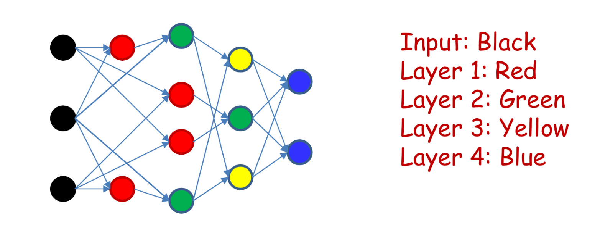
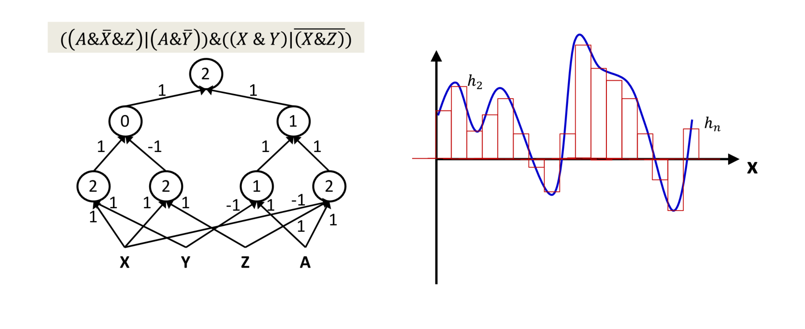
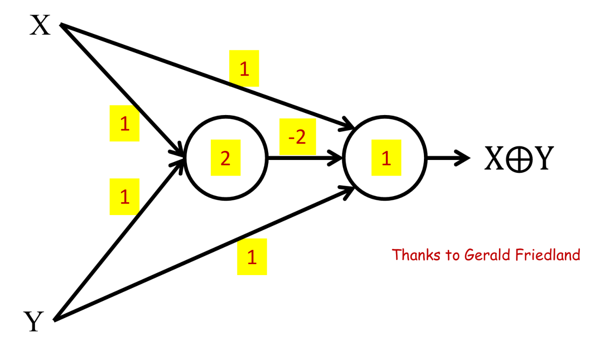
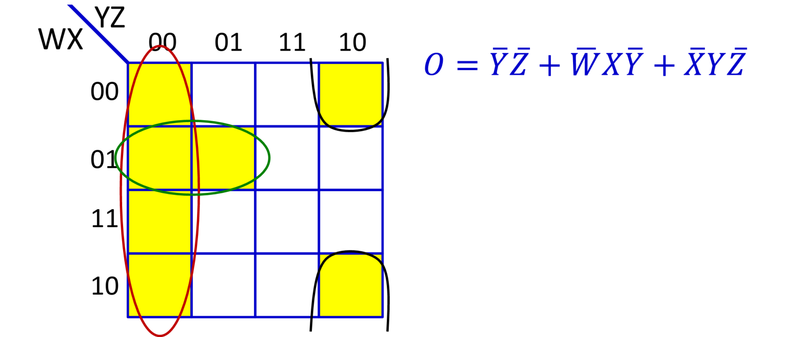
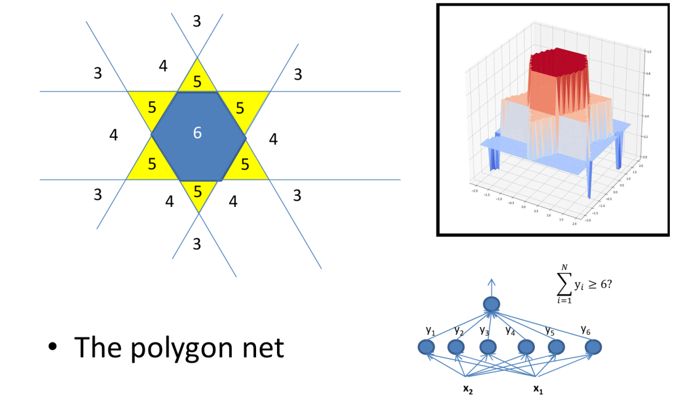
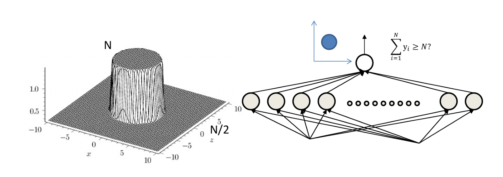

# Perceptron Function

先计算一个仿射，$z=\sum_{i} w_i x_i + b$

## Logistic

非常熟悉的

$$
f(z)=\frac{1}{1 + \exp(-z)}
$$

## Others

- $\tanh(z)$
- 

# 多层感知 Multi-layer Perceptron

## 深度的定义 Depth

对于一个有向图

- **source**: 只有出边的点
- **sink**: 只有入边的点

一个**图**的深度就是最长的一条从 source 到 sink 的路径的长度。

$$
\text{Depth}=\max_{x\in V_{\text{source}}, y\in V_{\text{sink}}} \mathrm{dis}(x, y)
$$

多层感知机是一个有向图（废话）

对于 多层感知的一个层，其深度是 层中节点相对于 input (source) 的深度，且需要满足 output (sink) 层的深度至少为 $3$ 。

- 对于 universal classifiers 和 universal Boolean functions 来说，需要足够的深度。
- 对于 universal approximators 来说，需要充足的深度和宽度（每一个 layer 的节点数量）

**Tips**:

- 对于相同的问题，深度越大，所需要的神经元就越少。激活函数需要提供一些必要的信息。
- 不是深度足够大，就能拟合所有函数，需要激活函数配合。
- Graded 激活函数可以减少神经元的使用量。

## 对 Boolean Functiion 的拟合 approximate functions

现在尝试用一个神经元去拟合 Boolean function : 

神经元可以拟合任意的双变量的 Boolean 运算 （除了 XOR ）。

### 多变量的 AND 运算 

形如：

$$
\left(\bigwedge_{i=1}^L X_i\right)\wedge \left(\bigwedge_{i=L+1}^N \bar{X}_i\right)
$$

设置一个 threshold 为 $L$ 的神经元（只有输入的和 $\ge L$ 才会被激活产生输出），然后根据输入 $X_i$ 的正/反设置 $w_i$ 为 $1$/$-1$ 即可，一个不符合条件都会让 $\sum_i w_i X_i$ 减小，且输入最多是 $L$ 。

### 多变量的 OR 运算

形如：

$$
\left(\bigvee_{i=1}^L X_i\right)\vee \left(\bigvee_{i=L+1}^N \bar{X}_i\right)
$$

设置 threshold 为 $N-L+1$ 即可，其余和 AND 一样。输入的和的最小值是 $N-L$ ，只需要其中一个满足条件都可以让和 $+1$ .

### 双变量的 XOR

单个神经元不能处理，需要将其拆分成 $(X\wedge \bar{Y})\vee(\bar{X} \wedge Y)$ 。使用三个神经元，其中两个是同一个隐藏层。

或者使用另一个更精密的结构，使用两个神经元和 $5$ 个权重：

### Normal Form Formula (DNF)

现在已知，任何布尔函数都会有一个真值表，里头记录了每一个能产生 true output 的 input 的组合，可以将整个函数视为 input组合形成的 AND 运算的 OR 。也就是可以将每一个 组合设置成一个隐藏层的神经元，然后再将这些神经元的输出做一个 OR 运算，即为输出，因此只需要一个隐藏层（input 组合）

假设 一个 input 组合为 $C_j=(v_{j,1}, \dots, v_{j,n})_i$ ，那么对应的 AND 运算表达式即为 

$$
S_j = \bigwedge_{i=1}^n \begin{cases} X_i & \text{if } v_{j,i}=\text{True} \\ \bar{X}_i & \text{otherwise}\end{cases}
$$

最终的输出就是 

$$
\text{Output} = \bigvee_{j=1}^m S_j
$$

实际上这种表达式被称为 normal form formula (DNF)

MLP 的复杂度定义为 DNF 的最小项数（项数可以进行优化，下面说）。
### Karnaugh Map

可以用来简化 DNF .

- 两个相邻的黄格子可以合并
- 或者一列/一行的黄格子可以合并
- 一行/一列的头尾黄格子可以合并

假设 Karnaugh Map 组成了棋盘状的颜色，那么对于只有一个隐藏层的 MLP，完全没法合并，需要产生 $2^{N-1}$ 个表达式 ($N$ 为变量个数) 。实际上棋盘状是连续的 XOR 运算。

### XOR 运算的优化

这时候，如果可以使用多层，那么可以只使用 $3(N-1)$ 个神经元 （将前 $i-1$ 个变量的结果和第 $i$ 个进行合并，需要 $3$ 个神经元；需要合并 $N-1$ 次）

合并方式可以进行改进，使用类似归并排序的方式进行结果合并，需要 $2\log_2 N$ 层，

## 对于 classifier 类函数的拟合。

每个神经元可以取一个半平面 $(0/1)$ 。然后取交和 Boolean 的 AND 类似，取并则和 OR 类似。

### 正多边形的 Classifier

假如 MLP 需要对平面上的点 $(x,y)$ 做一个是否在正 $N$ 边形中的判断，那么有 $\text{Sum of input of final neural for }(x,y)\in \left[\frac{1}{2}N, N\right]$

可以发现随着 $N$ 增大，不在多边形的区域会朝着 $\frac{1}{2}N$ 演进。

假如在 $N$ 非常大的时候，添加一个 $-\frac{1}{2}N$ 到最后一个神经元，那么就会有 $\sum_{i=1}^N z_i -\frac{N}{2}\ge 0$ ($z_i$ 是最后一个神经元的输入)，得到一个不错的 决定 $(x,y)$ 是否在一个圆内的函数。

此时，假如我们只能使用一个隐藏层来拟合一些 unconvex 的形状，那么可以使用非常多的上述提到的圆形来拟合 (approximate) 这个 unconvex pattern.

## 对连续函数的拟合

一种方法是使用若干个先前提到的圆形，并乘上不同的 weight 来拟合（不能完全相同）。

