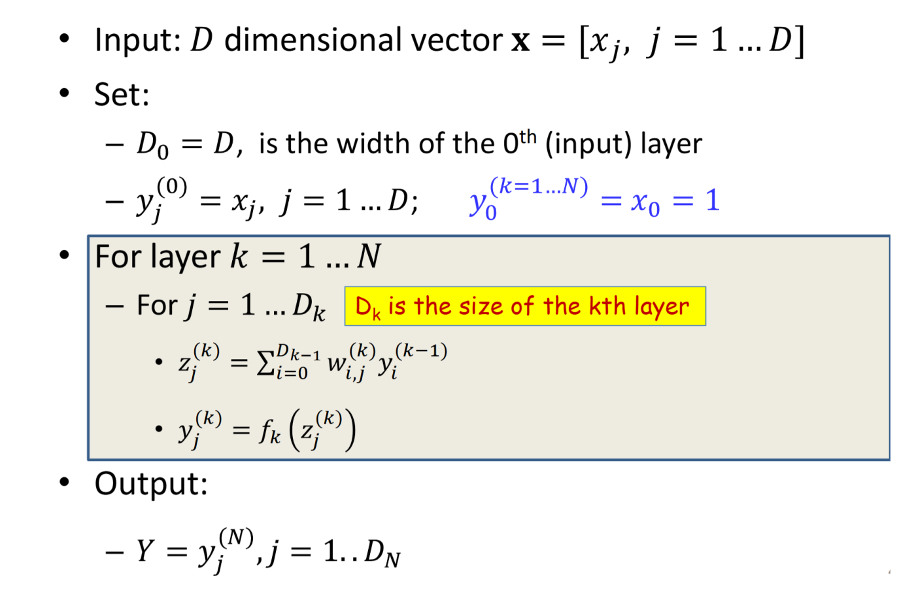
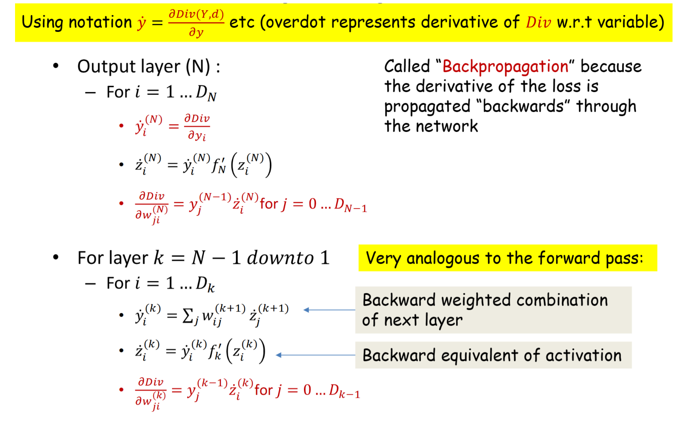
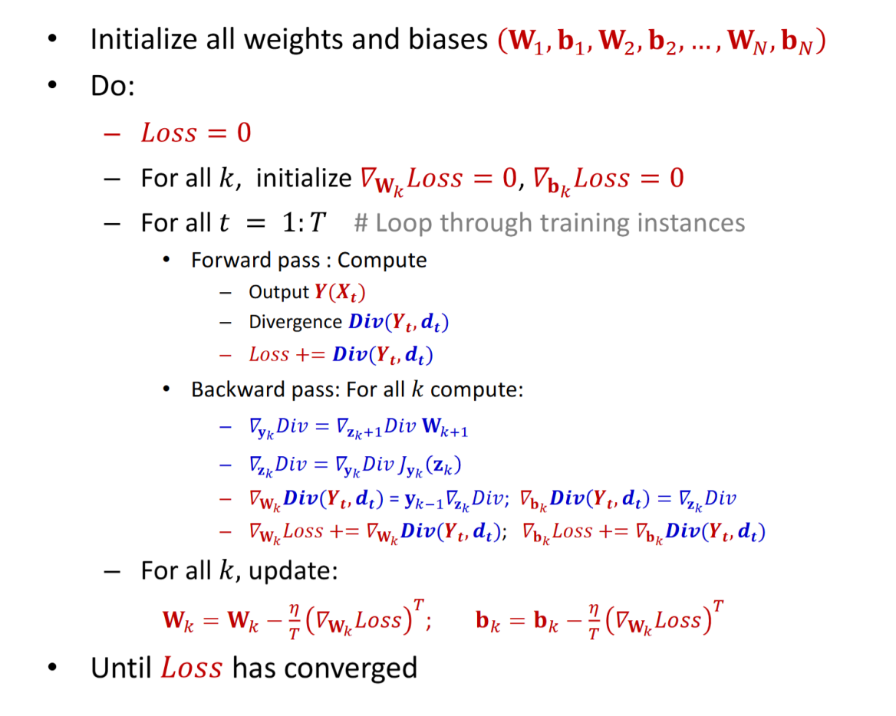

# Activations & Output

**Scaler Activation**:

| Name | $f(z)=$ | $\frac{\mathrm{d} f}{\mathrm{d} z}=$ |
| :---: | :---: | :---: |
| Sigmoid | $\frac{1}{1 + \exp(-z)}$ | $f(z)(1-f(z))$ |
| tanh | $\frac{\exp(z)-\exp(-z)}{exp(z)+\exp(-z)}$ | $1 - (f(z))^2$ |
| ReLU | $\begin{cases} x & \text{if}~x\ge 0 \\ 0 & \text{otherwise}\end{cases}$ | $\mathbb{I}(x\ge 0)$ |
| SoftPlus | $\log(1 + \exp(z))$ | $\frac{1}{1 + \exp(-z)}$  |

**Vector Activation**: SoftMax

$$
(f(z))_i=\frac{\exp(z_i)}{\sum_{j=1}^n \exp(z_j)} ~\forall~i\in \{1,\dots, d\}, z\in \mathbb{R}^d
$$

# Divergence

## $\mathcal{L}_2$ Divergence For Real-valued Output

$$
\begin{aligned}
\text{div}\left(\hat{y}, y\right)&=\frac{1}{2}\left\Vert \hat{y}-y\right\Vert^2_2=\frac{1}{2}\sum_{i=1}^n \left((\hat{y})_i-y_i\right)^2 \\
\nabla_{\hat{y}}\text{div}\left(\hat{y}, y\right)&=\hat{y}-y
\end{aligned}
$$

## KL Divergence for Classifier

For binary classifier

$$
\begin{aligned}
\text{div}(\hat{y},y) &= -y\log \hat{y} - (1-y)\log (1 - \hat{y}) \\
\frac{\mathrm{d}~\text{div}(\hat{y}, y)}{\mathrm{d} \hat{y}} &= 
	\begin{cases}
		-\frac{1}{\hat{y}} &\text{if}~ y=1 \\
		\frac{1}{1 - \hat{y}} &\text{if}~ y=0
	\end{cases}
\end{aligned}
$$

For multi-class classifier, use one hot encoding, where $y_c=1$ .

$$
\begin{aligned}
\text{div}(\hat{y},y) &= \sum_{i=1}^n y_i \log \frac{y_i}{\hat{y}_i} = -\log \hat{y}_c \\
\frac{\partial \text{div}(\hat{y}, y)}{\partial \hat{y}_i} &= 
	\begin{cases}
		-\frac{1}{\hat{y}_c} &\text{if}~c=i  \\
		0 &\text{otherwise}
	\end{cases}
\end{aligned}
$$

# Forward Pass & Backward Pass

Forward Pass:

GD 中的 $x^{(t+1)}\leftarrow x^{(t)} - \eta^{(t)}\nabla_x f\left(x^{(t)}\right)$ ，实际上是

$$
w^{(t+1)}_{i,j}\leftarrow w^{(t)}_{i,j}-\eta^{(t)} \frac{1}{N}\sum_{a=1}^N \frac{\partial \mathrm{div}(\hat{y}_a, y_a)}{\partial w^{(t)_{i,j}}}
$$

**Chain Rule**: 

对于 $l=f(y), y=g(z)\Rightarrow l=f(g(z))$ 

$$
\frac{\mathrm{d} l}{\mathrm{d} z} = \underbrace{\frac{\mathrm{d} l}{\mathrm{d} y}}_{f}\underbrace{\frac{\mathrm{d} y}{\mathrm{d} z}}_{g}
$$

## Vector 写法

Forward Pass :

$$
\begin{aligned}
\mathbf{z}_k &= W_k \mathbf{y}_{k-1} + \mathbf{b}_k \\
\mathbf{y}_k &= f_k(\mathbf{z}_k) \\
\hat{\mathbf{y}} &= \mathbf{y}_L
\end{aligned}
$$

Backward Pass :

$$
\begin{aligned}
\nabla_{\mathbf{z}_k} \mathbf{y}_k &= \mathrm{diag}\left(f_k'(\mathbf{z}_k)\right) \\
\nabla_{\mathbf{z}_k} \mathrm{div} &= \nabla_{\mathbf{y}_k} \mathrm{div} \cdot \nabla_{\mathbf{z}_k} \mathbf{y}_k \\
	&= \nabla_{\mathbf{y}_k} \mathrm{div} \cdot \mathrm{diag}\left(f_k'(\mathbf{z}_k)\right) \\
\nabla_{\mathbf{y}_{k-1}} \mathrm{div} &= \nabla_{\mathbf{z}_k} \mathrm{div} \cdot \nabla_{\mathbf{y}_{k-1}} \mathbf{z}_k \\
	&= \nabla_{\mathbf{z}_k} \mathrm{div} \cdot W_k \\
\nabla_{W_k} \mathrm{div} &= \mathbf{y}_{k-1} \cdot \nabla_{\mathbf{z}_k} \mathrm{div} \\
\nabla_{\mathbf{b}_k} \mathrm{div} &= \nabla_{\mathbf{z}_k} \mathrm{div}
\end{aligned}
$$

然后得到一整个训练过程：

