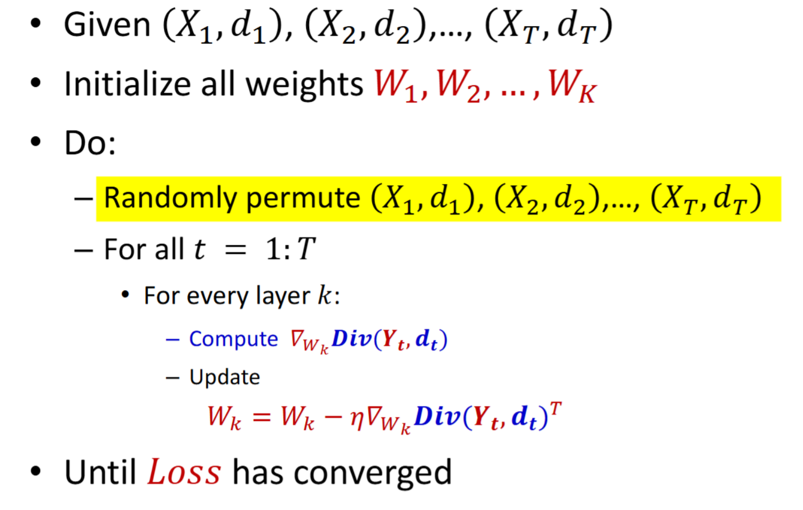
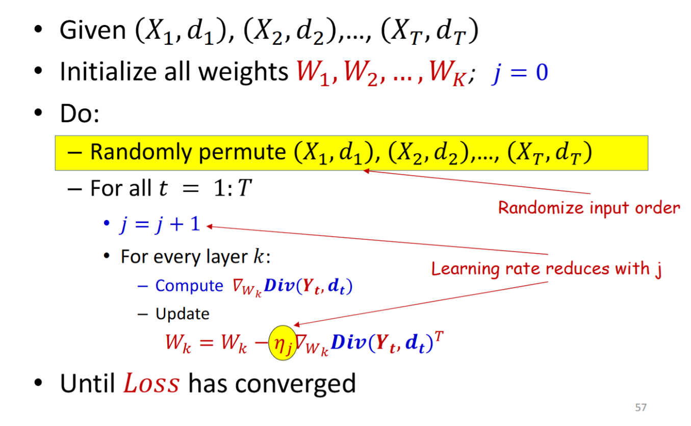
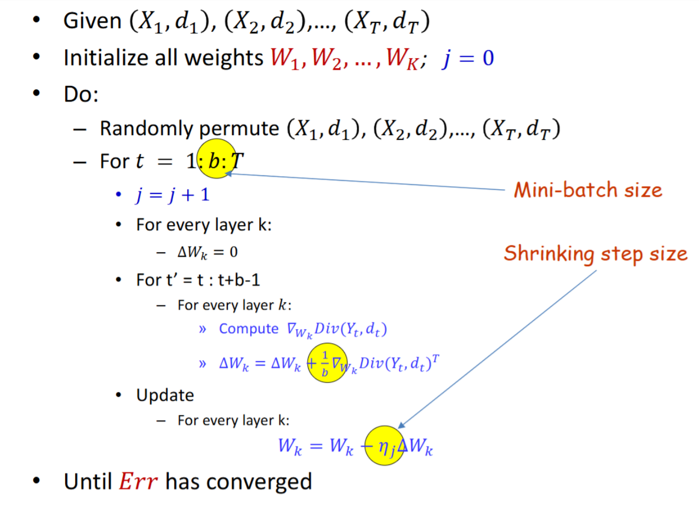

# Stochastic Gradient Descent (SGD)

上一个 Lecture Note 的 GD 实际上是 Batch Gradient Descent (Batch GD) 。(不是 Mini-batch GD)

对于大规模数据集，计算整个 $\nabla_{\theta} \mathrm{Loss}(\theta)$ 代价过高，所以我们使用 SGD.

每一轮随机打乱数据集，然后逐个进行 forward, backward, update.

这种逐个使用数据方式，称为 Incremental learning 。

每次都会使用最新的样本，可能使得最新的样本影响过大，导致震荡较大。考虑一个 Linear Model，数据点分布在一条直线上，如果每次都使用最新的样本进行更新，可能会导致模型参数在直线上来回震荡。一种解决方式是 收缩学习率 (shrinking learning rate)，即随着迭代次数增加，逐渐减小学习率 $\eta$.

一个 SGD 收敛的充分条件是：

$$
\sum_{t=1}^{\infty} \eta_t = \infty, \quad \sum_{t=1}^{\infty} \eta_t^2 < \infty
$$

如果 $\text{Loss}$ 是 convex 的，那么就会得到 global optimum ；否则会收敛到一个 local minimum 。

SGD 会得到更快的收敛，但是得到的解不如 Batch GD 稳定。不稳定的来源是，SGD 每次只使用一个样本进行更新，梯度的方差较大，且样本的方差（和实际需要拟合的函数的差距）会影响最终的解。

# Mini-batch Gradient Descent

一种折中方式是 Mini-batch GD，每次随机使用 $B$ 个样本进行更新。

一般来说 Convergence 是指在整个数据集上的 Loss 收敛，但是这不太可行 (infeasible) 。有两种替代方式：
1. 使用一个 Validation Set 进行 Loss 估计；
2. 取先前所有的 (samples/batches) Loss 平均值。

一般来说，batch size 越大越好。因为这可以产生更小的方差，更少的 每轮更新次数。

对于 learning rate 的选择，有两种方式：

1. 先固定 learning rate，当 error (loss) 趋于稳定的时候，然后按照固定的 rate 减小 learning rate;
2. 使用自适应 learning rate 方法 (如 AdaGrad, RMSProp, Adam 等)。

# Momentum Update

保存一些历史梯度信息，可以加速拟合，减少震荡的时间。

$$
\begin{aligned}
\Delta W^{(t)} &= \beta \Delta W^{(t-1)} - \eta \nabla_{W} \mathrm{Loss}(W^{(t-1)})^\top \\
W^{(t)} &= W^{(t-1)} + \Delta W^{(t)}
\end{aligned}
$$

一般来说选取 $\beta=0.9$.

## Nesterov Accelerated Gradient (NAG)

修改一下 Momentum Update 的计算方式，先按照上一次的更新，走一步，然后再计算这一步到达位置的梯度，然后进行更新。

$$
\begin{aligned}
\Delta W^{(t)} &= \beta \Delta W^{(t-1)} - \eta \nabla_{W} \mathrm{Loss}\left(W^{(t-1)} + \beta \Delta W^{(t-1)}\right)^\top \\
W^{(t)} &= W^{(t-1)} + \Delta W^{(t)}
\end{aligned}
$$

可以更快收敛。

原理：SGD 和 Mini-batch GD 有较大的方差，Momentum Update 可以看作是对梯度进行平滑 (smoothing)，减少方差，从而更快收敛。

# Root Mean Square Propagation (RMSProp)

RMSProp 是一种自适应 learning rate 的方法。给震荡的参数分配较小的 learning rate，给平稳的参数分配较大的 learning rate 。RMSProp 也可以 smooth variance 。

计算梯度平方的平均值：$\mathbb{E}\left[(\nabla_{W^{(t)}} \mathrm{Loss})^2\right]$.

然后使用如下方式计算：

$$
\begin{aligned}
\mathbb{E}\left[\left(\nabla_{W} \mathrm{Loss}\left(W^{(t)}\right)\right)^2\right]
	&= \beta \mathbb{E}\left[
		\left(\nabla_{W} \mathrm{Loss}\left(W^{(t-1)}\right)\right)^2
		\right]
	 + (1-\beta) \left(\nabla_{W} \mathrm{Loss}\left(W^{(t-1)}\right)\right)^2 \\
W^{(t)} &= W^{(t-1)} - \frac{\eta}{\sqrt{\mathbb{E}\left[\left(\nabla_{W} \mathrm{Loss}\left(W^{(t)}\right)\right)^2\right] + \epsilon}} \nabla_{W} \mathrm{Loss}\left(W^{(t-1)}\right)^\top
\end{aligned}
$$

一般来说 选取 $\beta=0.9, \eta=0.001$.

# Adam

实际上是 RMSProp + Momentum Update。用 RMSProp 调整 learning rate，用 Momentum Update 平滑梯度 。

$$
\begin{aligned}
m_t &= \delta m_{t-1} + (1 - \delta) \nabla_W \mathrm{Loss}\left(W^{(t-1)}\right) \\
v_t &= \gamma v_{t-1} + (1 - \gamma) \left(\nabla_W \mathrm{Loss}\left(W^{(t-1)}\right)\right)^2 \\
\hat{m}_t &= \frac{m_t}{1 - \delta^t} \\
\hat{v}_t &= \frac{v_t}{1 - \gamma^t} \\
W^{(t)} &= W^{(t-1)} - \frac{\eta}{\sqrt{\hat{v}_t} + \epsilon} \hat{m}_t
\end{aligned}
$$

计算 $\hat{m}_t, \hat{v}_t$ 是为了防止早期 $\delta, \gamma$ 过于影响迭代。

一般来说是 $\delta=0.9, \gamma=0.999, \eta=0.001$ 。不会选择很大的 $\eta$ ，因为 RMSProp 和 Momentum Update 都会放大 $\eta$.

