# CNN

对于序列和空间扫描，而且内容和位置没有太大关系，只和局部趋势（形状）有关的时候，我们可以复用一个小的神经网络，然后组合成一个大的。

分开多层有如下优点，而且可以使用更少的参数：

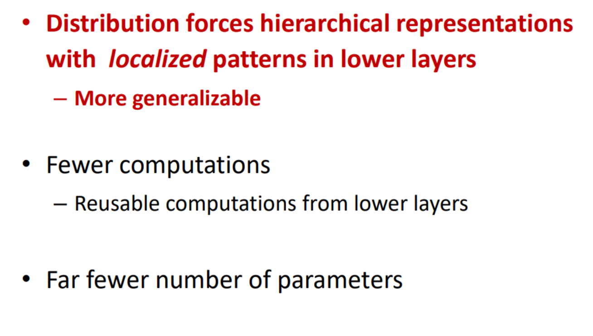

卷积神经网络包含 卷积层 (Convolution Layer) 和池化层 (Pooling Layer) ，卷积和池化交替进行。

卷积层的结构如下，包含若干个 kernel 。
在进行卷积之前可能需要进行 padding 操作，将一个 $w\times h$ 矩阵拓展成一个 $(w+2a)\times(h+2b)$ 的矩阵，或者将 长度是 $l$ 的序列变为长度为 $l+2a$ 的序列。具体来说，就是在边框填上指定宽度的 $0$ 。

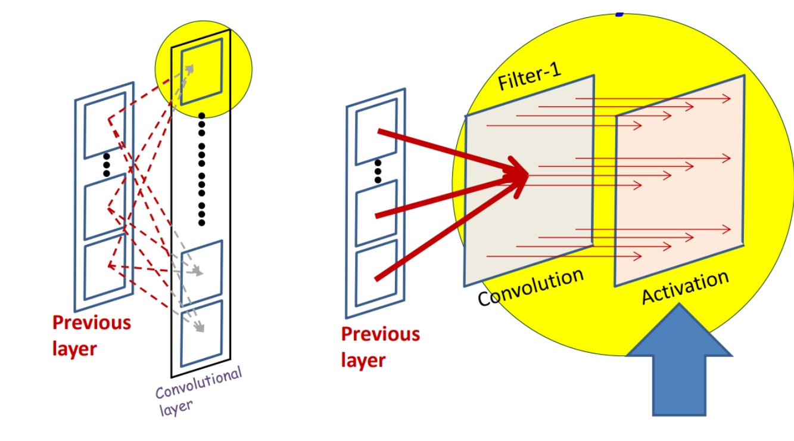

池化层有多种选项，Max Pooling / Mean Pooling 比较常见。此外，还有 $p$-norm : $y=\left(\frac{1}{w_k h_k} \sum_{i,j} x_{i,j}^p\right)^{\frac{1}{p}}$ ，或者是一个小的神经网络。

Downsampling （下采样）可以通过一个步长为 $S$ 的卷积/池化操作实现。

Upsampling 就是对于每个点直接添加 $S-1$ 个空行/空列，或者设置一个 $S<1$ 

# RNN

之前提到的神经网络都属于 Finite Response System，而 Infinite Response System 的定义如下：

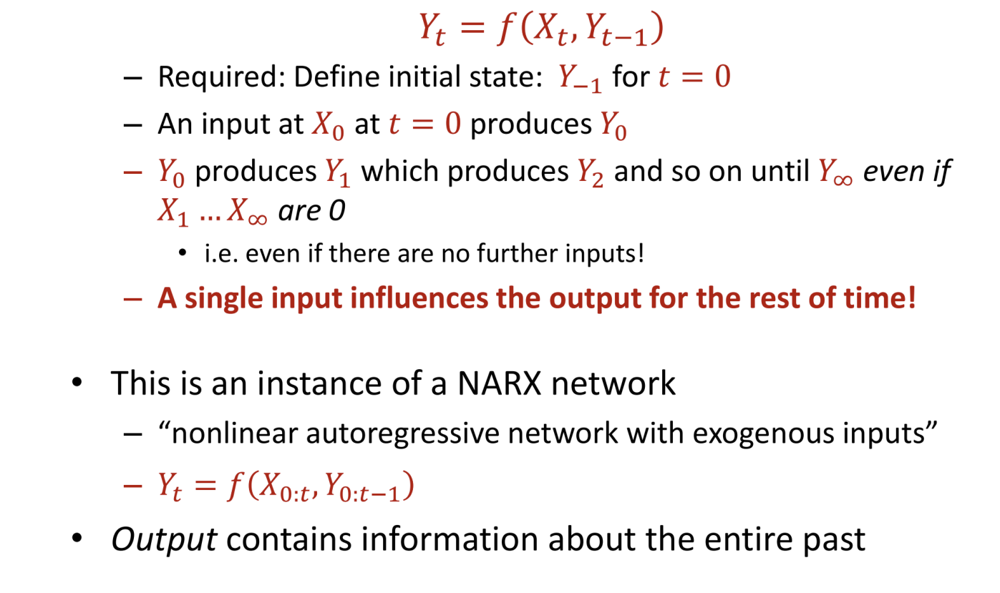

## NARX

抽取一下关键点：每一个输入都会对之后的输出有影响。NARX 的每一个输入包含完整的过去的信息。注意，输出的 $Y_{1\cdots t-1}$ 也会被用于 $Y_t$ 的计算。

NARX 结构图如下：

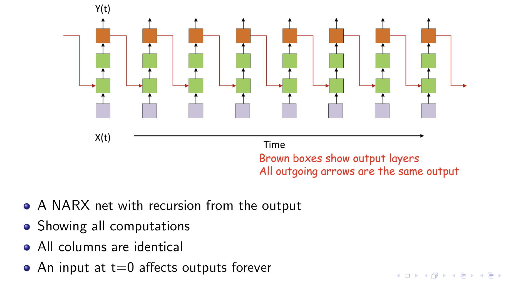

NARX 可以用于
- 天气预报
- 股票市场
- 追踪系统的替换建模
- 语言模型

PS: “memory” of the past is in the output itself, and not in the network .

分析一下这个网络要计算的信息：

$$
\begin{aligned}
m_t &= r(y_{t-1}, h_{t-1}, m_{t-1}) \\
h_t &= f(x_t,  m_t) \\
y_t &= g(h_t)
\end{aligned}
$$

其中 $m_t$ 是关于过去的 "memory" ，然后使用过去的记忆和当前的输入获取一些信息，然后再根据信息进行推理，得到 $y_t$ .

## Jordan Network

使用一个固定的计算方式来获取 "memory" （不可学习）

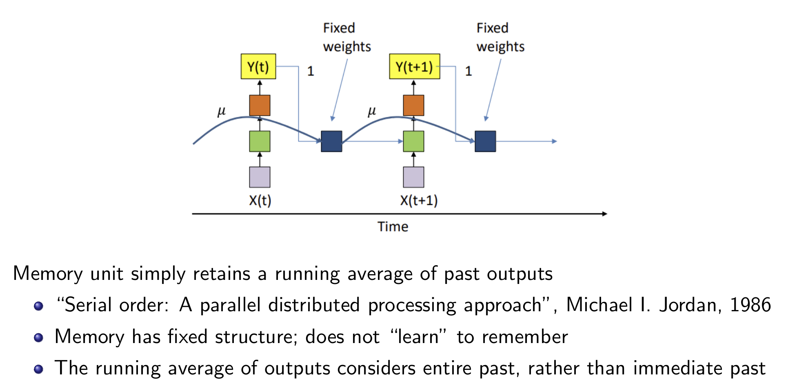

## Single Hidden Layer RNN

$$
\begin{aligned}
h_t &= f(x_t, h_{t-1}) \\
y_t &= g(h_t)
\end{aligned}
$$

或者使用如下的方式：

$$
\begin{aligned}
\mathbf{h}^{(1)}(t)&=f_1\left(W^{(1)}\mathbf{x}(t) + W^{(11)} \mathbf{h}^{(1)}(t-1) + \mathbf{b}^{(1)}\right) \\
\mathbf{y}(t)&=f_2\left(W^{(2)}\mathbf{h}^{(1)}(t) + \mathbf{b}^{(2)}\right) \\
\end{aligned}
$$

其中 $h^{(1)}(-1)$ 可以作为模型参数的一部分。

### Training of Single Hidden Layer RNN

现在假设 $\mathrm{div}$/$\mathrm{Loss}$ 是一个输入为 $\mathrm{y}_{1\dots T}$ ，输出为实数的函数。

令 $\mathbf{z}^{(1)}(t)=W^{(1)}\mathbf{x}(t) + W^{(11)} \mathbf{h}^{(1)}(t-1) + \mathbf{b}^{(1)}$, $\mathbf{z}^{(2)}(t)=W^{(2)}\mathbf{h}^{(1)}(t) + \mathbf{b}^{(2)}$ 。

那么有:

$$
\begin{aligned}
\nabla_{\mathbf{z}^{(2)}(t)}\mathrm{Loss} &= \nabla_{\mathbf{y}(t)}\mathrm{Loss} \nabla_{\mathbf{z}^{(2)}(t)} \mathbf{y}(t) \\
\nabla_{\mathbf{h}^{(1)}(t)}\mathrm{Loss} &= \nabla_{\mathbf{z}^{(2)}(t)}\mathrm{Loss}\times W^{(2)} + \nabla_{\mathbf{z}^{(1)}(t+1)}\mathrm{Loss}\times W^{(11)} \\
\nabla_{\mathbf{z}^{(1)}(t)}\mathrm{Loss} &= \nabla_{\mathbf{h}^{(1)}(t)}\mathrm{Loss} \nabla_{\mathbf{z}^{(1)}(t)}\mathbf{h}^{(1)}(t) \\
\nabla_{W^{(2)}}\mathrm{Loss} &\xleftarrow {+} \mathbf{h}^{(1)}(t) \nabla_{\mathbf{z}^{(2)}(t)}\mathrm{Loss} \\
\nabla_{W^{(11)}}\mathrm{Loss} &\xleftarrow {+} \mathbf{h}^{(1)}(t-1) \nabla_{\mathbf{z}^{(1)}(t)}\mathrm{Loss} \\
\nabla_{W^{(1)}}\mathrm{Loss} &\xleftarrow {+} \mathbf{x}(t) \nabla_{\mathbf{z}^{(1)}(t)}\mathrm{Loss} \\
\nabla_{h^{(1)}(-1)}\mathrm{Loss} &= \nabla_{\mathbf{z}^{(1)}(0)}\mathrm{Loss} \times W^{(11)}
\end{aligned}
$$

## Multiple Recurrent Layer RNN

最简单也是最常用的模型：

$$
\begin{aligned}
\mathbf{h}^{(0)}(t) &= \mathbf{x}(t) \\
\mathbf{h}^{(i)}(t)&=f_1\left(W^{(i)}\mathbf{h}^{(i-1)}(t) + W^{(ii)} \mathbf{h}^{(i)}(t-1) + \mathbf{b}^{(i)}\right) \\
\mathbf{y}(t)&=f_2\left(W^{(n+1)}\mathbf{h}^{(n)}(t) + \mathbf{b}^{(n+1)}\right) \\
\end{aligned}
$$

这里假设 RNN 有 $n$ 个隐藏层。

## Bidirectional RNN

一个正向，一个反向。当整个序列都可见的时候比较实用。有正反交错和独自计算两种：

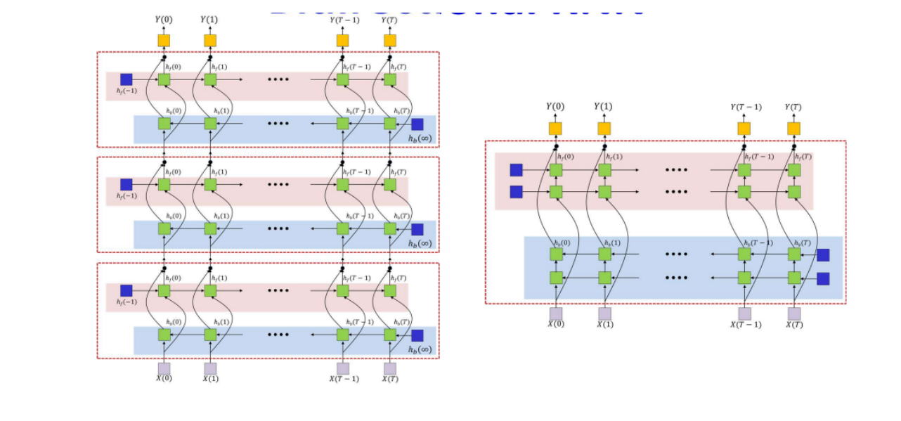

对于正反都是单层的，首先从 $T\rightarrow 0$ 计算 $\mathbf{h}_f$ 的梯度，然后从 $0\rightarrow T$ 计算 $\mathbf{h}_b$ 的梯度，当然两者可以互换。

## Long Short-Term Memory (LSTM)

设置一个特别的 LSTM Cell，这个 Cell 接受三个输入：1. $\mathbf{x}(t)$; 2. $\mathbf{h}(t-1)$, state; 3. $\mathbf{c}(t-1)$ linear history ，输出为 $\mathbf{h}(t)$, $\mathbf{c}(t)$ 。使用 Sigmoid 作为 Gate Function $\sigma$.

每一个 Gate 都有对应的名称：
- $f_t$ ： "forget" gate，需要携带多少的 history
- $i_t$ ： "input" gate，表示新的输入是否值得被记忆
- $o_t$ ： "output" gate，表示形成的记忆有多少需要展示到输出中

理想状态下，LSTM 可以永久记忆一个 pattern。

计算式如下：

$$
\begin{aligned}
\mathbf{i}_t &= \sigma (W_i[\mathbf{c}_{t-1};\mathbf{h}_{t-1};\mathbf{x}_t] + \mathbf{b}_i) \\
\mathbf{f}_t &= \sigma (W_f[\mathbf{c}_{t-1};\mathbf{h}_{t-1};\mathbf{x}_t] + \mathbf{b}_f) \\
\mathbf{o}_t &= \sigma (W_o[\mathbf{c}_t; \mathbf{h}_{t-1};\mathbf{x}_t] + \mathbf{b}_o) \\
\tilde{\mathbf{c}}_t &= \tanh (W_c[\mathbf{h}_{t-1};\mathbf{x}_t] + \mathbf{b}_c) \\
\mathbf{c}_t &= \mathbf{f}_t\odot \mathbf{c}_{t-1} + \mathbf{i}_t \odot \tilde{\mathbf{c}}_t \\
\mathbf{h}_t &= \mathbf{o}_t \odot \tanh (\mathbf{c}_t)
\end{aligned}
$$

### Training of LSTM

重写一下前向传播，便于计算：

$$
\begin{aligned}
\mathbf{i}_t &= \sigma(\tilde{\mathbf{i}}_t) = \sigma (W_{ci}\mathbf{c}_{t-1} + W_{hi}\mathbf{h}_{t-1} + W_{xi}\mathbf{x}_t + \mathbf{b}_i) \\
\mathbf{f}_t &= \sigma(\tilde{\mathbf{f}}_t) = \sigma (W_{cf}\mathbf{c}_{t-1} + W_{hf}\mathbf{h}_{t-1} + W_{xf}\mathbf{x}_t + \mathbf{b}_f) \\
\mathbf{o}_t &= \sigma(\tilde{\mathbf{o}}_t) = \sigma (W_{co}\mathbf{c}_t + W_{ho}\mathbf{h}_{t-1} + W_{xo}\mathbf{x}_t + \mathbf{b}_o) \\
\tilde{\mathbf{c}}_t &= \tanh (W_{hc}\mathbf{h}_{t-1} + W_{xc}\mathbf{x}_t + \mathbf{b}_c) \\
\mathbf{c}_t &= \mathbf{f}_t\odot \mathbf{c}_{t-1} + \mathbf{i}_t \odot \tilde{\mathbf{c}}_t \\
\mathbf{m}_t &= \tanh (\mathbf{c}_t) \\
\mathbf{h}_t &= \mathbf{o}_t \odot \mathbf{m}_t
\end{aligned}
$$

现在假设已知

$$
\begin{aligned}
\nabla_{\mathbf{h}_t}\mathrm{Loss}, & \nabla_{\mathbf{c}_t}^{\text{future}}\mathrm{Loss}
\end{aligned}
$$

可以推导出反向传播的公式：

首先对于 $\nabla_{\mathbf{c}_t}\mathrm{Loss}$ :

$$
\begin{aligned}
\nabla_{\mathbf{o}_t}\mathrm{Loss} &= \nabla_{\mathbf{h}_t}\mathrm{Loss} \odot \mathbf{m}_t \\
\nabla_{\mathbf{m}_t}\mathrm{Loss} &= \nabla_{\mathbf{h}_t}\mathrm{Loss} \odot \mathbf{o}_t \\
\hline
\nabla_{\mathbf{c}_t}^{\text{from}~\mathbf{o}_t}\mathrm{Loss} &= \nabla_{\mathbf{o}_t}\mathrm{Loss} \nabla_{\mathbf{\tilde{o}}_t}\mathbf{o}_t \nabla_{\mathbf{c}_t} \tilde{\mathbf{c}}_t = \nabla_{\mathbf{h}_t}\mathrm{Loss} \odot \mathbf{m}_t \odot \mathbf{o}_t\odot (1-\mathbf{o}_t) W_{co}\\
\nabla_{\mathbf{c}_t}^{\text{from}~\mathbf{m}_t}\mathrm{Loss} &= \nabla_{\mathbf{m}_t}\mathrm{Loss}\odot (1 - \mathbf{m}_t^2) = \nabla_{\mathbf{h}_t}\mathrm{Loss} \odot \mathbf{o}_t \odot (1 - \mathbf{m}_t^2) \\
\hline
\Rightarrow \nabla_{\mathbf{c}_t}\mathrm{Loss} &=\nabla_{\mathbf{h}_t}\mathrm{Loss} \odot \mathbf{o}_t \odot \left[ (1 - \mathbf{m}_t^2) + \mathbf{m}_t \odot (1-\mathbf{o}_t) W_{co}\right] + \nabla_{\mathbf{c}_t}^{\text{future}}\mathrm{Loss}
\end{aligned}
$$

另外，对于三个门的仿射输入，有：

$$
\begin{aligned}
\nabla_{\tilde{\mathbf{i}}_t}\mathrm{Loss} &= \nabla_{\mathbf{i}_t}\mathrm{Loss} \odot \mathbf{i}_t \odot (1 - \mathbf{i}_t)  \\
\nabla_{\tilde{\mathbf{f}}_t}\mathrm{Loss} &= \nabla_{\mathbf{f}_t}\mathrm{Loss} \odot \mathbf{f}_t \odot (1 - \mathbf{f}_t)  \\
\nabla_{\tilde{\mathbf{o}}_t}\mathrm{Loss} &= \nabla_{\mathbf{o}_t}\mathrm{Loss} \odot \mathbf{o}_t \odot (1 - \mathbf{o}_t)  \\
\nabla_{\mathbf{i}_t}\mathrm{Loss} &= \nabla_{\mathbf{c}_t}\mathrm{Loss}\odot \tilde{\mathbf{c}}_t \\
\nabla_{\mathbf{f}_t}\mathrm{Loss} &= \nabla_{\mathbf{c}_t}\mathrm{Loss}\odot \tilde{\mathbf{c}}_{t-1} \\
\hline
\Rightarrow
\nabla_{\tilde{\mathbf{i}}_t}\mathrm{Loss} &= \nabla_{\mathbf{c}_t}\mathrm{Loss}\odot \tilde{\mathbf{c}}_t \nabla_{\mathbf{i}_t}\mathrm{Loss} \odot \mathbf{i}_t \odot (1 - \mathbf{i}_t) \\
\nabla_{\tilde{\mathbf{f}}_t}\mathrm{Loss} &= \nabla_{\mathbf{c}_t}\mathrm{Loss}\odot \tilde{\mathbf{c}}_{t-1} \odot \mathbf{f}_t \odot (1 - \mathbf{f}_t) \\
\nabla_{\tilde{\mathbf{o}}_t}\mathrm{Loss} &= \nabla_{\mathbf{h}_t}\mathrm{Loss} \odot \mathbf{m}_t \odot \mathbf{o}_t \odot (1 - \mathbf{o}_t)
\end{aligned}
$$

此外，还需要计算 $\nabla_{\mathbf{c}_{t-1}}^{\text{future}}\mathrm{Loss}$, $\nabla_{\mathbf{h}_{t-1}}\mathrm{Loss}$ 以及 $\nabla_{\mathbf{x}_t}\mathrm{Loss}$ :

$$
\begin{aligned}
\nabla_{\tilde{c}_t}\mathrm{Loss} &= \nabla_{\mathbf{c}_t}\mathrm{Loss} \odot \mathbf{i}_t \\
\nabla_{\mathbf{h}_{t-1}}^{\text{from}~\tilde{\mathbf{c}}_i}\mathrm{Loss} &= \nabla_{\tilde{c}_t}\mathrm{Loss} \cdot (1 - \tilde{\mathbf{c}}_t^2) W_{hc} \\
\nabla_{\mathbf{x}_t}^{\text{from}~\tilde{\mathbf{c}}_i}\mathrm{Loss} &= \nabla_{\tilde{c}_t}\mathrm{Loss} \cdot (1 - \tilde{\mathbf{c}}_t^2) W_{xc} \\
\hline
\Rightarrow \nabla_{\mathbf{h}_{t-1}}\mathrm{Loss} &= \nabla_{\tilde{\mathbf{i}}_t}\mathrm{Loss}~W_{hi} + \nabla_{\tilde{\mathbf{f}}_t}\mathrm{Loss}~W_{hf} + \nabla_{\tilde{\mathbf{o}}_t}\mathrm{Loss}~W_{ho} + \nabla_{\mathbf{h}_{t-1}}^{\text{from}~\tilde{\mathbf{c}}_i}\mathrm{Loss} \\
\\
\nabla_{\mathbf{c}_{t-1}}^{\text{future}}\mathrm{Loss} &= \nabla_{\mathbf{c}_t}\mathrm{Loss} \odot \mathbf{f}_t + \nabla_{\tilde{\mathbf{i}}_t}\mathrm{Loss}~W_{ci} + \nabla_{\tilde{\mathbf{f}}_t}\mathrm{Loss}~W_{cf} \\
\\
\nabla_{\mathbf{x}_t}\mathrm{Loss} &= \nabla_{\tilde{\mathbf{i}}_t}\mathrm{Loss}~W_{xi} + \nabla_{\tilde{\mathbf{f}}_t}\mathrm{Loss}~W_{xf} + \nabla_{\tilde{\mathbf{o}}_t}\mathrm{Loss}~W_{xo} + \nabla_{\mathbf{x}_t}^{\text{from}~\tilde{\mathbf{c}}_i}\mathrm{Loss}
\end{aligned} \\
$$

接下来可以计算梯度更新：

$$
\begin{aligned}
\nabla_{W_{xi}}\mathrm{Loss} &\xleftarrow{+} \mathbf{x}_t \nabla_{\tilde{\mathbf{i}}_t}\mathrm{Loss} \\
\nabla_{W_{hi}}\mathrm{Loss} &\xleftarrow{+} \mathbf{h}_{t-1} \nabla_{\tilde{\mathbf{i}}_t}\mathrm{Loss} \\
\nabla_{W_{ci}}\mathrm{Loss} &\xleftarrow{+} \mathbf{c}_{t-1} \nabla_{\tilde{\mathbf{i}}_t}\mathrm{Loss} \\
\nabla_{\mathbf{b}_i}\mathrm{Loss} &\xleftarrow{+} \nabla_{\tilde{\mathbf{i}}_t}\mathrm{Loss} \\
\dots
\end{aligned}
$$

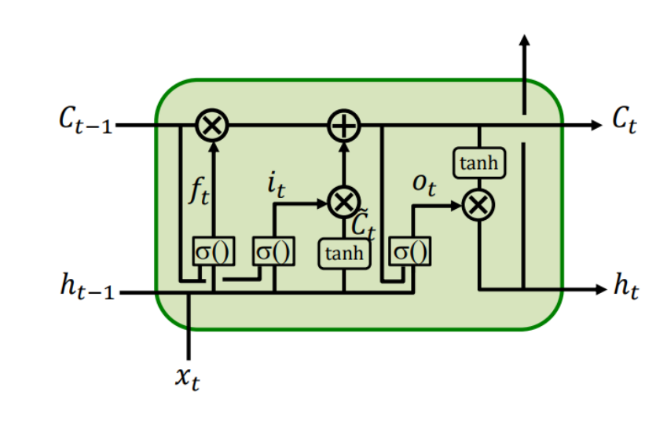

## Gated Recurrent Units ，简化的 LSTM Cell

不需要区分压缩和常规的记忆。

$$
\begin{aligned}
\mathbf{z}_t &= \sigma(W_z[\mathbf{h}_{t-1}; \mathbf{x}_t]) \\
\mathbf{r}_t &= \sigma(W_r[\mathbf{h_{t-1}}; \mathbf{x}_t]) \\
\tilde{\mathbf{h}}_t &= \tanh(W[\mathbf{r}_t\odot\mathbf{h}_{t-1}; \mathbf{x}_t]) \\
\mathbf{h}_t &= (1 - \mathbf{z}_t) \odot \mathbf{h}_{t-1} + \mathbf{z}_t \odot \tilde{\mathbf{h}_t}
\end{aligned}
$$

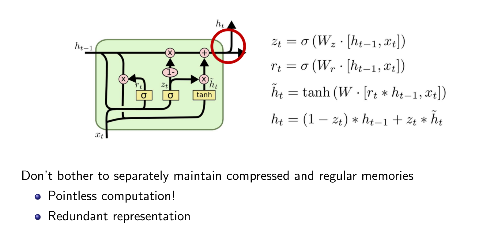

# Transformer

Transformer 是基于注意力机制的 Seq2Seq 模型。输出的序列可以完全不按照输入的顺序进行处理，也可以和输入只是有一定的相关性。

## Encoder & Decoder

假设使用两个 RNN ，第一个用于处理输入，得到最后的 hidden representation，第二个用于根据输入、先前的输出和直到上一个输出的 hidden representation 得到下一个输出，这实际上是一种 Encoder-Decoder 架构。

实际上 Encoder, Decoder 可以不是 RNN，甚至可以是 CNN，Encoder 只需要能根据输入导出每个位置的 hidden-state ，Decoder 也只需要能根据输入导出 hidden-state ，并根据 hidden-state 进行输出即可。

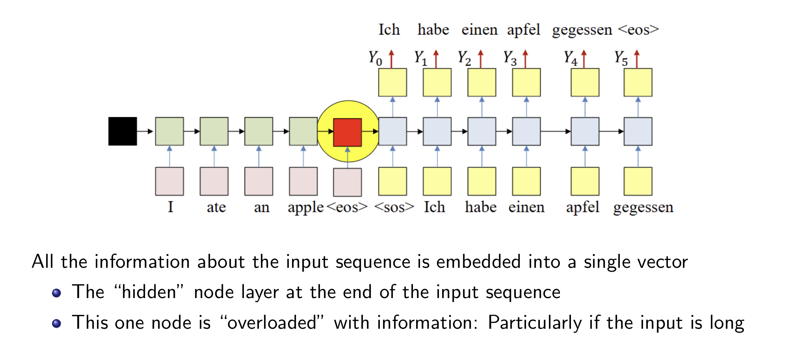

## Attention

但是实际上所有输入的hidden representation 都是有意义的。一种简单的解决方式：将所有的输入的 hidden state 取个平均值。但是这样的话每个 state 是相同的权重，并不是那么优秀，因此，可以针对每一个输出 $t$，为每一个 state 赋予一个权重 $w_i(t)$ ，然后得到对于每一个输出需要使用的上下文向量 (context vector) $c_t = \frac{1}{T_{\text{in}}}\sum_{i=1}^{T_{\text{in}}} w_i(t) h_i$ 。

如果 $w_i(t)$ 有个不错的学习效果，那么模型就能 "focues" 到正确的输入上，产生合理的输出。这种权重就是注意力权重 (Attention Weight)

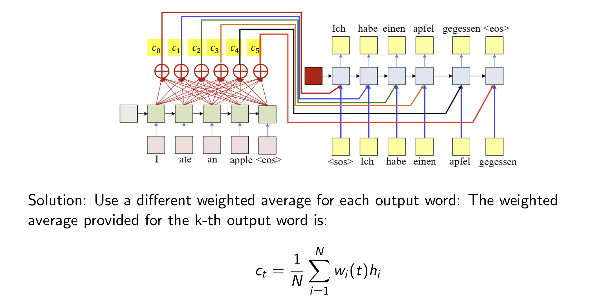

那么应当如何计算 $w_i(t)$ ？

首先需要明确一下性质：
- 这是一个 distribution，也就是 $\sum_{i=1}^{T_{\text{in}}} w_i(t) = 1$ ；
- 和输出的相关性越强，$w_i(t)$ 就应该越大。

一种计算方式如下：

$$
\begin{aligned}
e_i(t) &= g(\mathbf{h}_i, \mathbf{s}_{t-1}) \\
w_i(t) &= \frac{\exp(e_i(t))}{\sum_{j=1}^{T_\text{in}} \exp(e_j(t))} \\
\mathbf{c}_t &= \sum_{i=1}^{T_\text{in}} w_i(t)\mathbf{h}_i
\end{aligned}
$$

也就是根据 encoder 的 hidden state，以及模型的上一个 decoder 中的 hidden state，来决定这一个位置的权重。

注意 $\mathbf{s}_{-1}$ 可以

1. 是一个可学习的参数
2. 一个固定值
3. encoder 的 $\mathbf{h}$ 的平均值
4. 或者 $W_{-1}\overline{\mathbf{h}}$ ，其中 $W_{-1}$ 是可学习的参数。

$g(\mathbf{a}, \mathbf{b})$ 可以有很多种选择，标红的部分是可学习的参数：

- Dot Product: $\mathbf{a}^\top \mathbf{b}$ 
- Bilinear: $\mathbf{a}^\top \textcolor{red}{W_g} \mathbf{b}$ 
- Nonlinear: $\textcolor{red}{\mathbf{v}_g}^\top \tanh\left(\textcolor{red}{W_g} \begin{bmatrix}\mathbf{a} \\ \mathbf{b} \end{bmatrix}\right)$ 
- $\textcolor{red}{\mathrm{MLP}}([\mathbf{a}, \mathbf{b}])$
- **Scaled Dot Product**: $\frac{\mathbf{a}^\top \mathbf{b}}{\sqrt{\Vert \mathbf{a}\Vert}}$

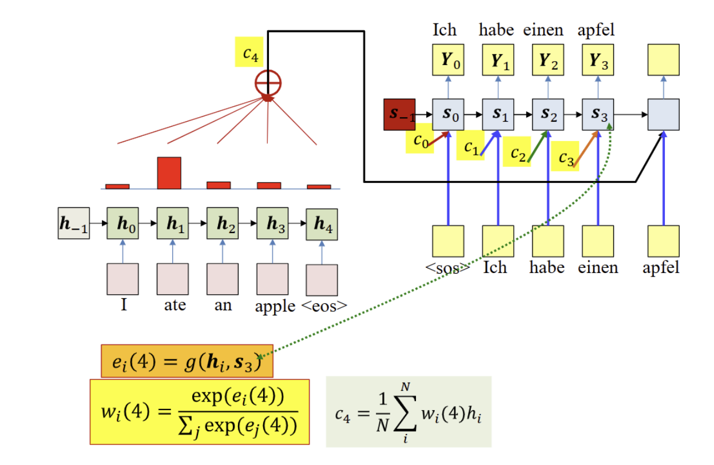

## KVQ

从 Encoder 的 $\mathbf{h}$ 导出 Key 和 Value ，其中 Key 用于表示这个 input 在当前 $t$ 的重要程度；然后从 Decoder 的 $\mathbf{s}$ 导出 Query 表示当前需要注意哪个 input 。具体来说，导出方式如下：

$$
\mathbf{k}_i = W_k \mathbf{h}_i, \quad \mathbf{v}_i = W_v \mathbf{h}_i, \quad \mathbf{q}_t = W_q \mathbf{s}_{t-1}
$$

接下来，使用 $\mathbf{k}_i, \mathbf{q}_t$ 重新计算注意力权重，然后和 $\mathbf{v}_i$ 合并，计算出上下文向量：

$$
\begin{aligned}
e_i(t) &= g(\mathbf{k}_i, \mathbf{q}_t) \\
w_i(t) &= \frac{\exp(e_i(t))}{\sum_{j=1}^{T_\text{in}} \exp(e_j(t))} \\
\mathbf{c}_t &= \sum_{i=1}^{T_\text{in}} w_i(t)\mathbf{v}_i
\end{aligned}
$$

一种特殊情况就是 $\mathbf{k}_i = \mathbf{v}_i = \mathbf{h}_i, \mathbf{q}_t = \mathbf{s}_{t-1}$ ，接下来我们都基于这个情况计算。

## Types of Attention

注意力有很多种形式，假设有两个序列 $\{a_i\}, \{b_i\}$
- Cross Attention: $a_i\rightarrow b_j~\forall~i,j$，使用 decoder 的 Query 和 encoder 的 Key
- Self Attention: $a_i\rightarrow a_j~\forall~i,j$，使用 Value ，可以在 Encoder 或者 Decoder 中使用。

## Attention Is All You Need

Transformer 是一个完全建立在 Attention 机制上的模型，利用上了 GPU 矩阵运算的并行性。

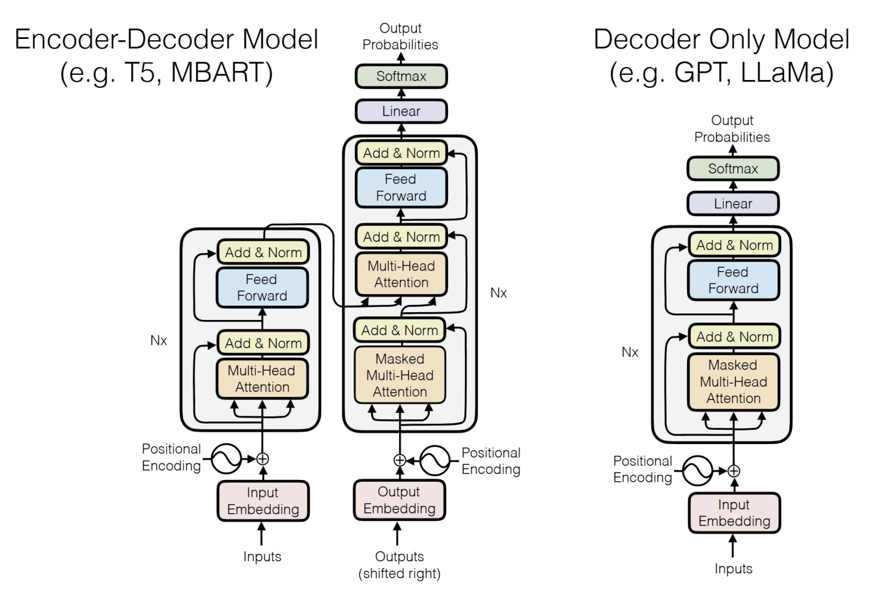

### Tokenization & Embedding Layer

tokenizer 将一个词划分成若干个 token, 每个 token 实际上就是一个整数。

然后 Embedding Layer 将 token 转化为一个连续空间的向量 。Embedding Layer 是一个表，每个 token 对应一个独立的可学习向量。在实际计算的时候，为了并行化，假设有一个 token序列 $\{t_i\}_1^n$ ，会将其转换成一个 one-hot 矩阵 $X\in \mathbb{R}^{n\times |V|}$ ，而表格实际上是一个矩阵 $W\in\mathbb{R}^{|V|\times D}$ ，那么最终得到的向量序列就是 $Y=XW$ 。

### Position Encoding

为了添加位置信息，需要使用 Position Encoding 。使用三角函数，周期性能够保证长序列也可以有独一无二的位置编码：

$$
p_t^{(i)} = f(t)^{(i)} = \begin{cases}
\sin(\omega_kt) & \text{if}~i=2k \\
\cos(\omega_kt) & \text{if}~i=2k + 1 \\
\end{cases}
, \omega_k = \frac{1}{10000^{2k/d}}
$$

Position Encoding 的结果和 Embedding Layer 的结果直接相加，就能得到多头注意力的输入。

### Feed Forward & Add & Norm

Feed Forward 是一个 MLP，以及非线性的激活函数，给模型添加非线性能力，Add & Norm 是一个残差连接和一个 layer normalization 。残差是将输入直接和输出相加（另一个常见的应用是 ResNet），用于避免梯度消失，帮助训练更深层次的网络；而 normalization 可以稳定熟练过程，减少 overfitting。

### Attention in Transformer

$$
\mathrm{Attention}(Q, K, V) = \mathrm{softmax}\left(\frac{QK^\top}{\sqrt{d_k}}\right) V
$$

一般来说 Transformer 中使用的注意力是
1. 自注意力（Encoder 和 Decoder 内部），其中 $Q=W_Q X, K=W_K X, V=W_V X, X\in \mathbb{R}^{T\times d}$。
2. 交叉注意力机制 （Encoder to Decoder）：Key, Value 来自 Encoder, Query 来自 Decoder

上图黑框框部分用于计算出一个强化了上下文内容的 Embedding，下图表示计算 $I_1$ 的注意力权重的示意图，可以发现，需要使用所有的 $K,V$ 和 $Q_1$ 自己。整个过程是可以平行计算的，也就是可以同时计算多个 $I$ 的注意力权重。

多头注意力 (Multi-Head Attention) 实际上是利用多个 $W_{Q_i}, W_{K_i}, W_{V_i}\in\mathbb{R}^{T\times d_h}, d_h=\frac{d_{\text{model}}}{h}$ 分别计算出多个注意力结果，用于不同的任务。

具体来说，计算过程如下：

$$
\begin{aligned}
Z_i &= \mathrm{Attention}(Q_i, K_i, V_i) = \mathrm{softmax}\left(\frac{Q_iK_i^\top}{\sqrt{d_\text{model}}}\right) V_i \\
\text{其中 } & Q_i=W_{Q_i} X,  K_i=W_{K_i} X,  V_i=W_{V_i} X \\
Z &= \mathrm{concat}(Z_1, Z_2, \dots, Z_h)
\end{aligned}
$$

而在输入的时候，我们可以看到整个序列，但是输出的时候，我们只能看到先前的序列，因此，Masked Multi-Head Attention 需要每次蒙上一个三角矩阵，让模型不能得到后面信息，也就是：

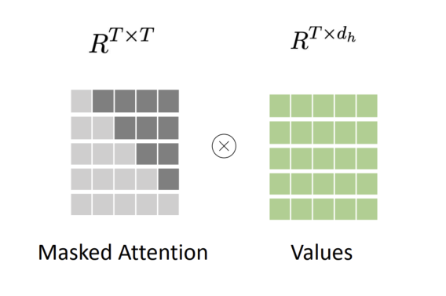

### Linear & Softmax

实际上是 $\mathrm{softmax}(YW), Y\in\mathbb{R}^{T_{\text{out}}\times d_{\text{model}}}, W\in\mathbb{R}^{d_{\text{model}}\times |V|}$ 其中 $Y$ 是来自 Decoder 的输出，$W$ 是可训练参数。