实际情况中，可以先预训练 (pre-train) 一个基础模型 (base model) ，然后再适配 (adapt) 不同 。

可以通过 1. 微调 (fine-tune) 这个模型；2. 设置特定提示词 (prompting) 

这样可以使用更少的数据来获取不错的效果。

- Masked language modeling: 给定一个序列，蒙住其中一个，然后让模型填这个被蒙住的词：常用于微调
$$
P(X) = \prod_{i=1}^{|X|} P(x_i|x_{\ne i})
$$
- Auto-regressive language modeling: 只提供前序词，用来 finetuning, prompting
$$
P(X)=\prod_{i=1}^{|X|} P(x_i|x_{<i})
$$

## ELMo

核心：一个较大的 biLSTM ($94\text{M}$)，拼接两个 LSTM 的输出从而得到对于每一个输入的词的向量表示。

可以提供每个词的上下文信息。

接下来是和 GloVo 的比较：

GloVo | ELMo
| :--- | :--- |
| 提供静态的 embedding ，每个词向量和其余的无关 | 可以提供包含上下文信息的 embedding |
| 不能分辨有多义词 | 可以处理多义词问题 (polysemy) |

# Masked language modeling

## BERT

一个多层自注意力模型，输入为一堆 词/[CLS]/subword 。用于 masked word prediction + next sentence prediction 。使用了 BooksCorpus + English Wikipedia 作为数据集。

对于 Masked Word Prediction:
- $80\%$ 的输入被替换为 [MASK]
- $10\%$ 被替换为随机词
- $10\%$ 不变

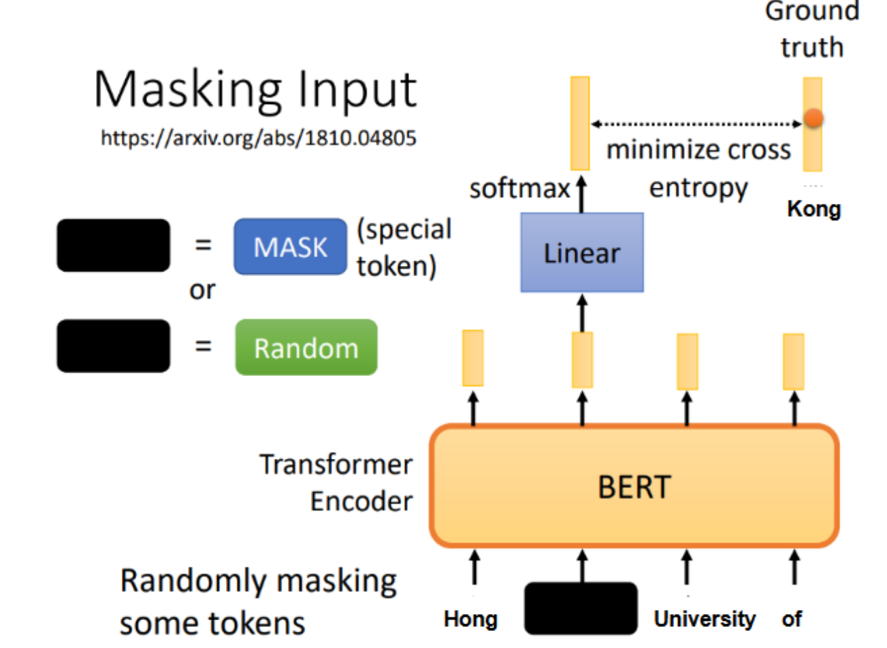

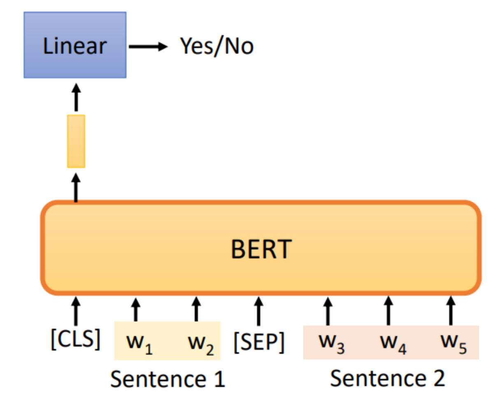

添加一个输出层，将 BERT 的 hidden vector 转化为 score .

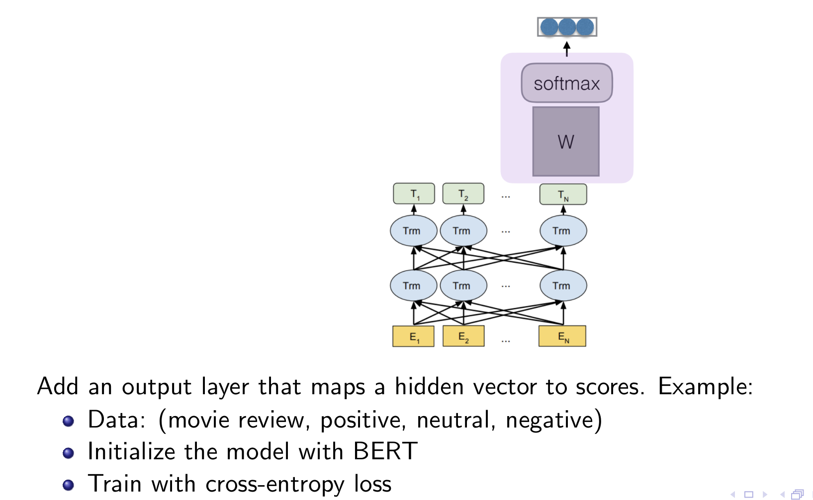

# Autoregressive language modeling

学习目标：

$$
\arg\min_{\theta}\sum_{x\in D_{\text{train}}}\sum_{t} - \log p_\theta(x_t | x_{<t})
$$

也就是，预测下一个 token.

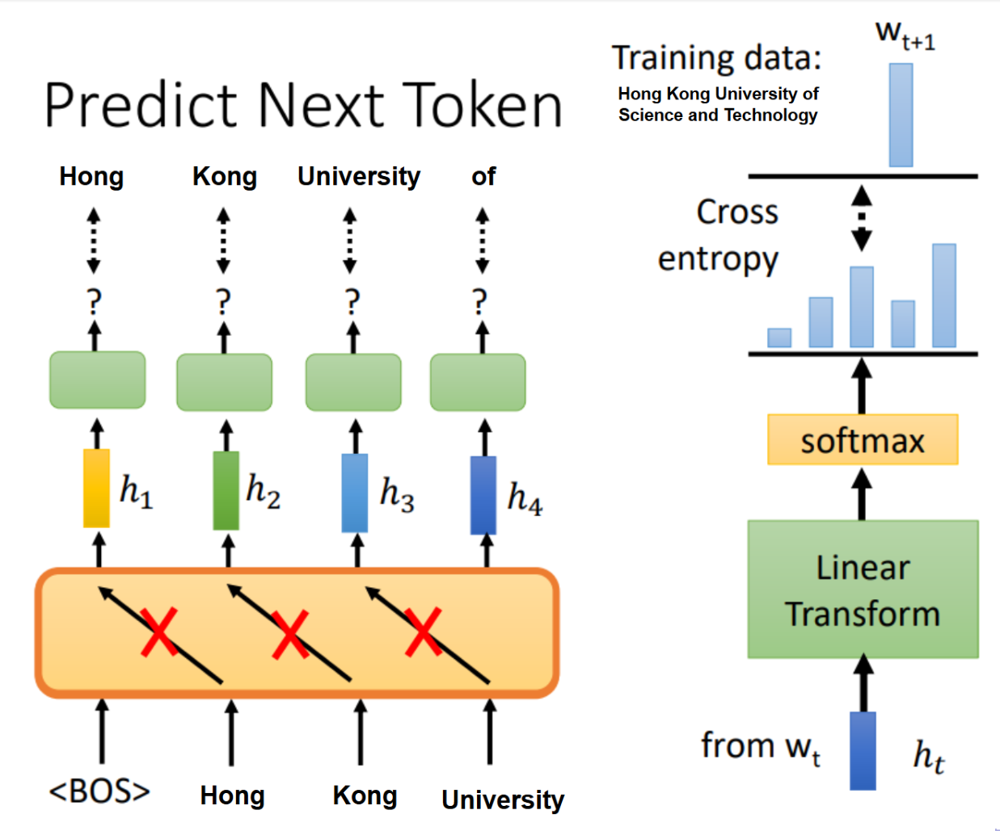

可以通过如下方式对模型评估：
1. Loss: 画出 train, validation, test 的 loss 曲线，和同族的模型进行比较
2. 使用 Few-shot prompting ，也就是在 prompt 中添加一些正确的例子
3. Fine-tuning

## E.g. GPT-2

- 架构: Transformer $1.5\text{B}$ 
- 训练数据: WebText (包含大量的网页)
- 在长文本生成和 zero-shot 任务的完成率上有显著提升

## Llama

- 架构: Transformer ，使用多种参数量, $6.7\text{B}, 13\text{B}, 32\text{B}, 65\text{B}$
- 训练数据: 总计 $1.4$ trillion tokens, 包含多个数据集

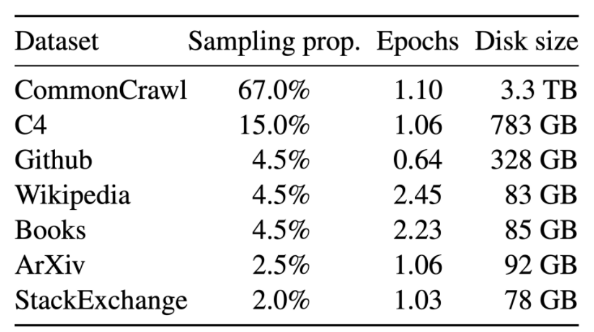

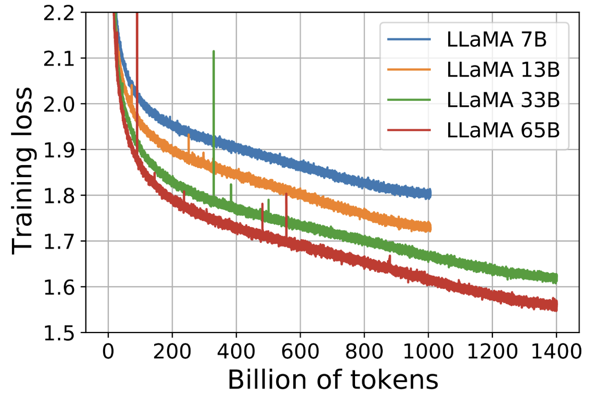

根据 Loss 曲线，可以发现，参数越大/数据量越大，Loss越小

### Few-shot Learning

不需要进行 梯度下降，直接在任务中提供一些 examples ，也叫 in-context learning 。

```
Translate English to French:
sea otter => loutre de mer
plush girafe => girafe peluche
cheese => 
```

实际上，模型的参数量越大，Few-shot Learning 的效果也会越好。

# Data: sources, quality and quantity

- Quantity: 需要多少数据
- Quality: 是否有益于训练
- Coverage: 是否数据已经覆盖了我需要的 domain，是否处于正确的比例 (prepertions)

## Quantity

数据量是越大越好。

## Quality

以数据集 common crawl 为例（从一堆网页的源代码 HTML 中得到文本）

### Extraction

将 HTML 转化为 text，需要去除样板代码 (css, boilerplate)，保留 Latex, Code, etc.

### Filtering

去除不需要的文本：
1. Language Filter
2. Repetitions
3. 过多短句 (Too many short lines)

### Deduplication

进行去重：
1. 使用 minihash 进行模糊
2. 但是过度去重可能有害

## Coverage

数据的分布会决定模型的输出分布，$p_{\text{model}}=p_{\text{data}}$ ，因此需要对数据进行一些过滤。

一种方式: classifier filtering

训练一个分类器来检测出需要的数据，过滤掉不需要的数据。

使用特化的数据集可以更快地收敛模型。

E.g.

1. OpenWebMath 数据集使用 MathScore 分类器检测 common crawl 中是否含有数学内容
2. FineWeb-Edu 先使用一个 Prompted LLM 来给每个文本打上标签，然后使用 (文本,标签) 训练分类器，然后使用分类器过滤 FineWeb 数据集

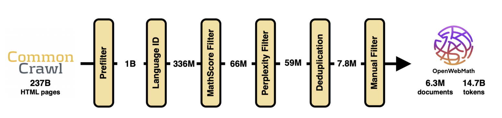

## Mixture

实际上，训练数据可能可以来自不同的数据集，可以进行混合。

# Think About Pretraining

## Scaling Laws

令 $N,D,C$ 分别表示 模型参数量, token 数量（数据集大小），compute 量 (浮点操作次数 FLOPs)

对于 transformer 模型，大概有：

$$
C\approx 6 ND
$$

而 Scaling Laws 认为：可以预测，随着 $C$ 上升，$\text{loss}$ 会被改进 Language modeling loss predictably improves with more compute

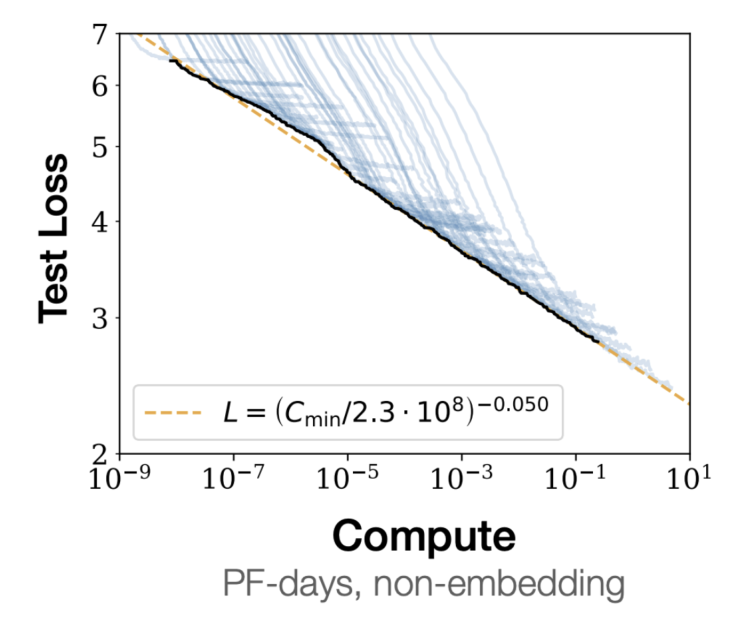

使用不同数量的 token 和 不同参数量地模型进行训练。

上图中：
- $\textcolor{blue}{\text{蓝线}}$: 训练中每一步的 loss
- $\textcolor{black}{\text{黑线}}$: 不同 $C$ 下的最小 loss ，被称为 Compute optimal
- $\textcolor{orange}{\text{橙线}}$: 对 $(C,\text{loss})$ 跑一个线性回归

然后得到了如下结果：

$$
L(C)\propto \frac{1}{C^{0.05}}
$$

Scaling Law 可以用于选择超参数，在小计算量上多跑几次实验，然后根据上面的公式，选择合适的超参数来训练大模型/使用大数据集。

根据数据量/参数量/超参数 （统称 setting）和 $\log C$ 的线性关系，使用小 $C$ 下的实验得到的**最优setting**，进行线性回归，可以得到大 $C$ 下的最优 setting。

具体而言，就是对于一个小 $C_0$ ，进行实验，得到可以让 $\text{loss}$ 最小的 setting $v(C_0)$，然后 将 $(\log C_0,v(C_0))$ 点到图上，使用不同的 $C_0$ 点更多的点，然后进行线性回归。

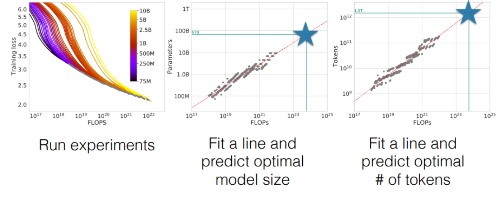

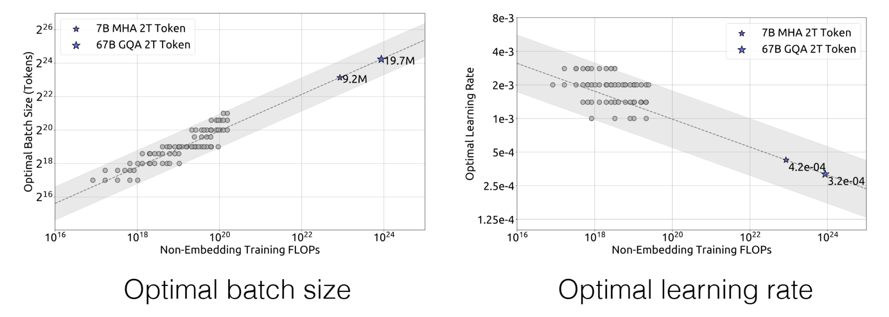

# Prompting

通过提供一个特制的文本形式 prompt 让模型进行特定的 prediction 

一般的流程：

1. Fill a prompt template
2. Predict the answer
3. Post-process the answer

## Prompt Template

```
Input:		x = "I love this movie."
Template: 	t = "[x] Overall, it was [z]"
Prompting: 	x'= "I love this movie. Overall it was [z]"
```

现在的模型都是 chatbots，使用如下格式作为输入：

```json
[
	{
		"role": "system",
		"content": "Please classify movie reviews as 'positive' or 'negative'."
	},
	{
		"role": "user",
		"content": "This movie is a banger."
	},
]
```

实际上，会被转化成类似如下的文本：

```
<|begin_of_text|><|start_header_id|>system<|end_header_id|>

"Please classify movie reviews as 'positive' or 'negative'.<|eot_id|>
<|start_header_id|>user<|end_header_id|>

This movie is a banger.<|eot_id|>
<|begin_of_text|><|start_header_id|>assistant<|end_header_id|>
```

## Post-processing

根据 answer, 选择实际的 Output.
1. 直接使用结果
2. 可视化 Visualization ，格式化输出。比如 ChatGPT 官网的渲染。
3. 仅选择要使用的结果 ``movie that was simply fantastic``$\rightarrow$``fantastic``
4. 将输出结果映射到其他操作（搜索，作图 etc）``fantastic``$\rightarrow$``positive``,``rubbish``$\rightarrow$``negative``

## Few-shot Prompting

上面已经展示了一次 few-shot 了。

对于 chatbot 格式的 prompt ，可以添加一组
```json
{
	"role": "system",
	"name": "example_user",
	"content": "..."
},
{
	"role": "system",
	"name": "example_assistant",
	"content": "..."
},
```

有时候只给 input, 而不是 (input, output)，效果会更好。又是给太多 example 也会导致效果变差，这和模型有关。而且 example 的内容，顺序和label balance 也会影响结果。

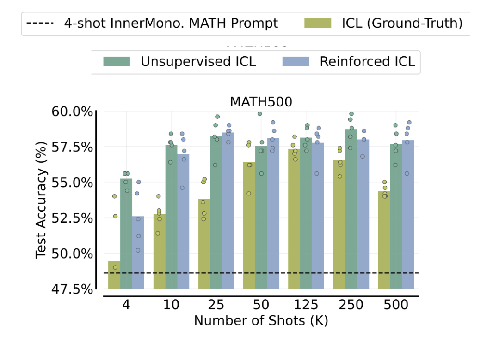

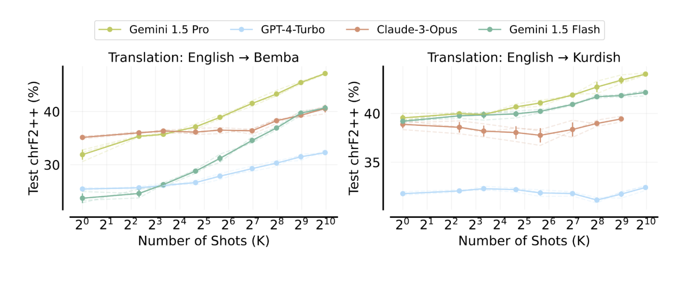

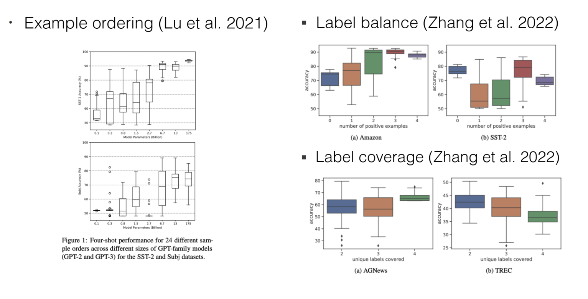


## Design of Prompts

- 手动设置一个模板
- 根据直觉设置
- 在一个离散空间中搜索
- 在一个连续空间中搜索

注意，prompt 的格式需要和模型匹配，格式会 显著影响模型的表现。

指令部分需要简单，清晰，容易理解 (clear,concise, easy to understand) ；可以假设你要用两到三句话向一个高校生解释指令。

### Automatic Prompt Engineering

- 使用 LLM
  - 使用模型来提出候选 prompts
  - 评估每个候选在任务中的表现
  - 进行迭代
- Prompt tuning
  - 优化 Embedding，而不是词
- Prefix tuning
  - 优化 attention keys/values 的向量

## CoT

让模型先进行推理，再输出，让模型获得适应性的计算时间。

如果不给例子，那么模型需要使用训练集中的 CoT 数据，或者 System Prompts

## Program-aided Language Models

让模型编程的方法，通过程序来获取输出。对数值问题有很好的效果。

## Self-Ask: Problem decomposition

将问题分解成多步：1. 先问子问题 2. 使用搜索引擎 3. 重复上述问题

## Prompt Chain

```
input->Model->中间结果->Model->中间结果-(->外部工具)->...->Output
```

# Fine-tune

标准训练过程如下：

$$
\arg\min_{\theta}\sum_{(x,y)\in D}\sum_{t} -\log p_{\theta}(y_t|y_t,x)
$$

从一个预训练模型开始训练会比从头开始 (from scratch) 会好不少。

实际上缩小概率分布：

$$
D_{\text{KL}}(p_{\text{data}}\Vert p_{\theta})\rightarrow D_{\text{KL}}(p_{\text{data fine-tune}}\Vert p_{\theta}; p_0)
$$

但是可能会
- 模型对其他不针对微调的任务表现变差
- 需要接受特定的格式
- 不能很好地 few-shot learning

## Instruction Tuning

如果微调模型来处理多种任务，可以使用 (instruction + input, output) 格式的数据。

instruction, input, output 可以是人工输入/来自数据集/模型生成

## Chat Tuning

修改 system prompt

## Knowledge Distillation 知识蒸馏

将一个大模型地知识蒸馏到小模型中，也就是让两个模型的差距减小，使用 KL 散度作为 loss 函数。

有两种，一种是 token-level 蒸馏：

$$
\begin{aligned}
&\min_{\theta} D_{\text{KL}}(q(y|x)\Vert p_{\theta}(y|x)) \\
=&\min_{\theta} \mathbb{E}_{y\sim q(y|x)} \left[\sum_t\sum_{y_t\in V} -q(y_t|y_{<t},x)\log p_{\theta}(y_t|y_{<t},x)\right]
\end{aligned}
$$

另一种是 sequence-level 蒸馏，使用 teacher 模型，根据输入得到对应的输出，然后使用这个 (input, output) 训练小模型，也可以得到：

$$
\begin{aligned}
&\min_{\theta} D_{\text{KL}}(q(y|x)\Vert p_{\theta}(y|x)) \\
=&\min_{\theta} \mathbb{E}_{y\sim q(y|x)} \left[-p_{\theta}(y|x)\right]
\end{aligned}
$$


## Low-Rank Adaptation (LoRA)

对于一个预训练模型的矩阵 $W\in \mathbb{R}^{d\times d}$ ，训练两个低秩矩阵 $A\in\mathbb{R}^{d\times r}, B\in\mathbb{R}^{r\times d}$ ，然后训练和评估的时候变成 $W'=W'+AB$ ，训练完成之后可以 $W\leftarrow AB$ 

## HydraLoRA

在整个领域中使用单个 LoRA 可能会导致性能下降，这是由于任务干扰造成的，尤其是在具有多样化子领域或任务的数据集中。

取而代之，使用一个 $A$ 来捕捉任务之间的普遍联系，然后使用不同的 $B$ 来完成特定任务，减少参数冗余，同时增强特定任务的学习能力 (reducing parameter redundancy while enhancing task-specific learning.) 。

## Unified View of Parameter-Efficient Fine-Tuning (PEFT)

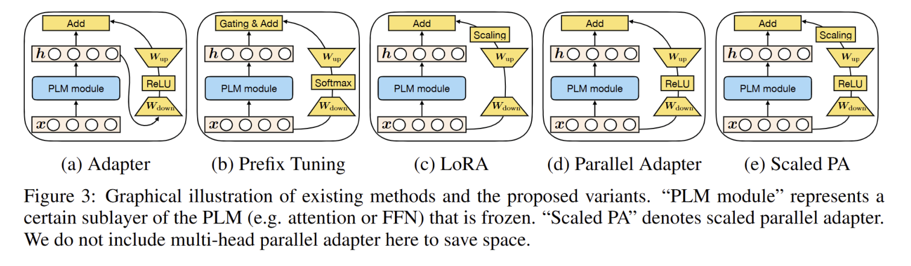