# Image Processing
## Vision Architecture Basics: Vision Transformer (ViT)

将图像转换为若干个向量。

ViT 工作流程：$\text{Image}\rightarrow\text{patches}\rightarrow\text{vectors}$

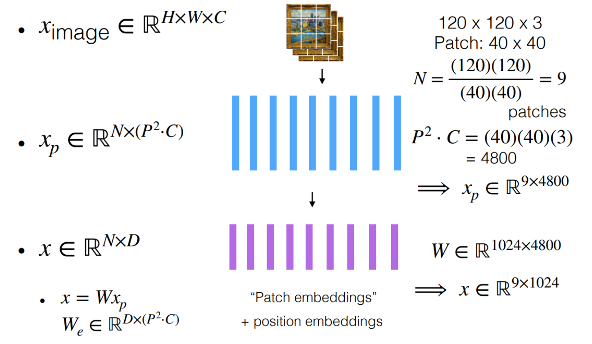

然后将 patch embedding 输入到 transformers encoder 中，得到向量表示 $z_1,\dots,z_n$ 

网络深度越大，模型关注的区域越大。

## Learning image representations: Language-Image Pre-training (CLIP)

公用一个 embedding space 来让一个模型来同时学习图像和文本表示。

使用两个 encoder $f_I(x)\rightarrow z_I,f_T(x)\rightarrow z_T$ 分别对图像和文本进行编码。

- 成对的图像和文本的向量应该很相近
- 不成对的就应该很远

$$
L=-\frac{1}{2}\sum_{n=1}^N\left[ \log\frac{\exp\left(f_I(x_n)^\top f_T(y_n)\right)}{\sum_{j=1}^N\exp\left(f_I(x_j)^\top f_T(y_n)\right)} + \log\frac{\exp\left(f_I(x_n)^\top f_T(y_n)\right)}{\sum_{j=1}^N\exp\left(f_I(x_n)^\top f_T(y_j)\right)}\right]
$$

就是一个 cross-entropy loss 。

# Multi-to-text

## Combining with a language model: Llava

使用 CLIP/ViT 将图像转换为向量序列之后，将向量序列处理为 token/embedding ，然后和普通的文本 token 一起处理。

可以对 CLIP/ViT 的输出使用线性变换，转换到 embedding space 中。

e.g. MOLMO (AI2)

# Multi-to-Image

使用模型生成图片是一种 sampling 操作。（嗯嗯，不知道为啥这样写）

## Autoregressive

将图像视为像素序列

任务变成：

$$
\begin{aligned}
&x_{\text{img}}\in \mathbb{R}^{H\times W\times C}\rightarrow x_1, \dots, x_T \\
\mathcal{L}_{\text{MLE}}&=\sum_{t=1}^T -\log p_{\theta}(x_t|x_{<t})
\end{aligned}
$$

challenges: 序列长度

e.g. 

1. PixelRNN：一个RNN，使用先前的所有像素来生成当前像素，可以直接使用大量的图像进行训练，不需要标记。
2. Image Transformer：需要使用一种记忆力效率更到的注意力模式

e.x. WaveNet for Audio

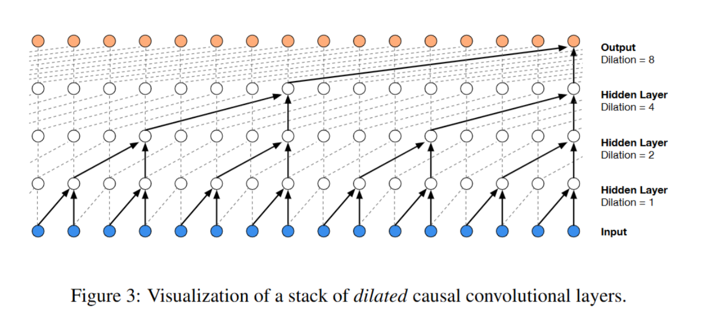

## Variational Auto-encoder (VAE)

### Auto-encoder

一个最简单的 Autoencoder (使用线性激活函数，只有一个向量)，所有的点被映射到一条直线上。

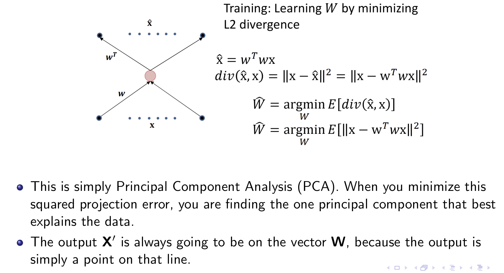

如果含有多个 $w$，也依然是一种 PCA 。

在中间添加非线性激活函数，可以获得一个 nonlinear PCA 。而增加隐藏层可以捕捉更复杂的非线性 manifold 。

当 hidden state 的维度小于输入，也被称为 bottleneck 网络。

而 decoder 部分只能生成位于训练学到的 manifold 上的数据，任何被输入到 hidden state 的数据都会被映射到和训练集中的点很相似的位置上。因此可以当成一个 数据集上的分布的生成器。

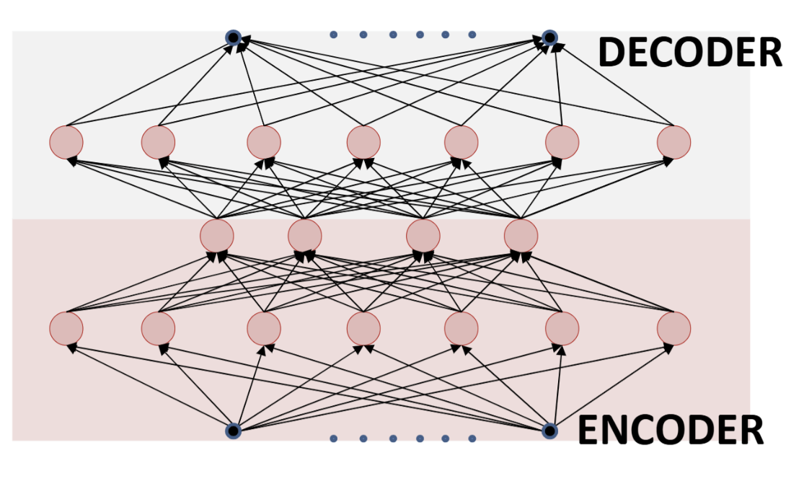

回到生成问题上来，我们需要模型学会某类图像的 distribution ，然后从这个 distribution 中采样一张图。
- 这里基于假设：数据的分布在高维空间中是一个 non-linear/linear manifold
- The principal components of all instances of the target class of data lie on this manifold

那我们可以使用上面的 decoder, 给他输入任意东西，就会输出一张看起来很合理的图。

但是有一个问题：对于在训练集上的数据，ae会表现得不错，但是如果不在训练集上，那么输出就会很奇怪，而且不可预测。

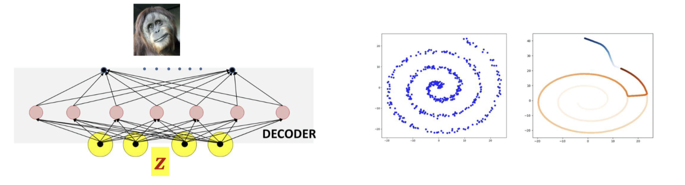

这需要让输入的 $z$ 符合 $z$ 的自然分布 (natural distribution)，也就是让 $z$ 是 typical 的，但我们并不知道 $z$ 的分布。

但是，我们可以通过模型、训练数据、学习过程来定义 $z$ ，因此可以直接施加一个分布给 $z$ 。

当我们训练 AE 的时候，可以直接给一个限制 $z$ ，说 $z$ 符合某个分布，典型的比如 $\mathcal{N}(0,I)$ ，一个标准正态分布。高斯分布是 least informative distribution ，因此相对于同样方差的其他分布，有更高的 entropy 。那么应当如何训练模型，使得这个 $z$ 符合分布？

考虑到高斯分布的特殊性：

1. 每个变量独立
2. negative log probability 和 变量的 square norm $\Vert \mathbb{x}\Vert^2$ 成正比。

因此最小化一个 KL 散度就可以了，或者说最小化 $z$ 的 square norm 就可以了

$$
\begin{aligned}
\min_{\theta,\phi} \sum_{x} |x-\hat{x}|^2+\lambda \Vert\mathbb{E}[x;\theta]\Vert^2
\end{aligned}
$$

但是有个问题，这个计算不能完全捕捉到方差，只能输出在一个 manifold 上。如果高维空间中的 $z$ 代表一个二维高斯分布，那么所有 $z$ 就代表一个平面——一个平面上的高斯分布。解码器将此平面映射到高维空间中的某种 manifold。任何输入到解码器的样本都只能位于这个平面上，无法离开这个平面。实际数据的维度就不得而知了。

而且这个 manifold 不能捕捉到所有我们需要生成的图像的信息。也就是说，即使我们成功得知了 manifold 的维度，自然数据中也依然包含一些相对于这个 manifold 的 variation （也可以说是噪声）。自然数据不会完全落在 manifold 上，只能说很接近 (lie close)

一种改进方式是：在 Decoder 输出后面添加一个噪声。

然后模型变成了这样子：生成一个 $z$ ，扔到 Decoder 里面，生成了一个东西，然后添加一个你设置的 noise 。

$$
\begin{aligned}
&e\sim P(e) \\
&z\sim\mathcal{N}(0,I)\rightarrow D(z;\phi)\rightarrow \hat{x} \\
&\hat{x}+e\rightarrow x 
\end{aligned}
$$

这里假设 noise 是一个 $\mathcal{N}(0,C)$ ，而一个经典假设是 $C=c\cdot \mathrm{diag}(\mathbb{1})$ 并且和 $z$ 无关。

训练目标变成了：

$$
\arg\min_{\phi}\mathbb{E}\left[\Vert D(z;\phi)-x\Vert^2\right]
$$

训练时候，我们需要一个 $z$，但是我们不知道 $z$ 是什么。这时候可以使用 encoder 来帮助估计 $z$ 

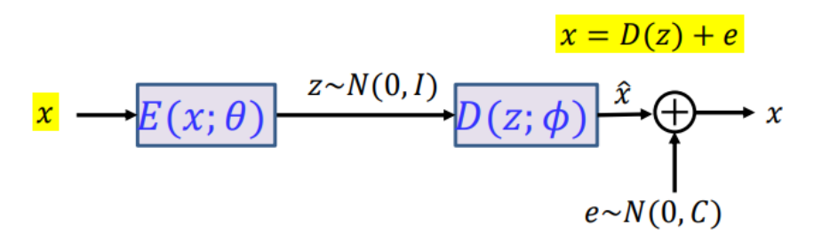

因为噪声的存在，对于给定的 $x$ ，不能确定唯一的 $z$ ，但是对于给定的 $x$ ，$z$ 满足一个分布，我们要 encoder 做的就是学习每个 $x$ 对应的 $z$ 的分布，让输出的 $z$ 最有可能通过 decoder 和 noise 获得 $x$ 。这个过程应用了 Variational Lower Bound 的最大值。

## Structure of The Variational Autio-encoder (VAE)

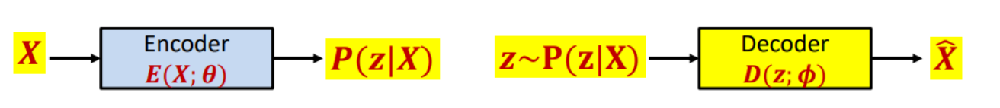

- Encoder 计算给定的点 $x$ 的 $z$ 的概率分布： $P(z|x)$ 
- Decoder 尝试从 $P(z|x)$ 中得到的 $z$ 的期望值转换为 $x$ 

### Encoder–Decoder 的联合训练目标
VAE 中 encoder 与 decoder 需要同时训练：
- **Encoder**：对每个输入 $x$，输出一个潜变量的条件分布 $Q(z|x)$，用于近似真实后验 $P(z|x)$。
- **Decoder**：从潜变量 $z$ 生成数据 $x$，即建模 $P(x|z)$。

与普通 auto-encoder 不同，encoder 并不输出一个确定的 latent code，而是输出一个 **分布**，从而允许不确定性与随机性。

---

### 带噪声的生成模型直观
假设 decoder 的输出并非精确落在低维流形上，而是：

$$
x = D(z) + \varepsilon, \quad \varepsilon \sim \mathcal{N}(0, C),
$$

其中 $C$ 是全秩但幅度较小的协方差矩阵。

这意味着：

- 数据分布集中在某个低维流形附近
- 但在高维空间中仍然是连续的、可建模的概率分布

---

### 变分推断与 ELBO
我们希望最小化 encoder 分布与真实后验之间的 KL 散度：

$$
\mathrm{KL}\big(Q(z|x)\,\|\,P(z|x)\big).
$$

利用贝叶斯公式：

$$
P(z|x) = \frac{P(x|z)P(z)}{P(x)},
$$

并展开 KL 散度，可以得到（忽略与参数无关的 $\log P(x)$）：

$$
\mathcal{L}(x)
=
\mathbb{E}_{z\sim Q(z|x)}[-\log P(x|z)]
+
\mathrm{KL}\big(Q(z|x)\,\|\,P(z)\big).
$$

这一定义了 VAE 的 **训练损失函数**（负的 ELBO）：
- 第一项：**重建误差**（训练 decoder）
- 第二项：**KL 正则项**（约束 encoder 输出分布）

---

### KL 项的意义
KL 正则项

$$
\mathrm{KL}\big(Q(z|x)\,\|\,P(z)\big)
$$

鼓励 encoder 输出的分布 $Q(z|x)$ 接近先验分布 $P(z)$。这样可以保证：

- 不同样本对应的 latent 分布不会彼此孤立
- 整体 latent space 结构良好、可采样

---

### 先验分布 $P(z)$ 的选择
通常选择

$$
P(z) = \mathcal{N}(0, I),
$$

原因包括：

- 各向同性、无偏
- 在固定方差下熵最大（least informative）
- 数学形式简单，KL 项可解析计算
- 对应的负对数概率与 $||z||^2$ 成正比

---

### Encoder 的参数化形式
真实后验 $P(z|x)$ 通常难以计算，因此假设近似后验为对角高斯：

$$
Q(z|x) = \mathcal{N}\big(z;\,\mu(x), \mathrm{diag}(\sigma^2(x))\big).
$$

Encoder 网络输出：

- 均值向量 $\mu(x)$
- 方差向量 $\sigma^2(x)$（或 $\log \sigma^2(x)$）

这将学习一个复杂分布的问题，转化为学习有限维网络参数的问题。

---

### Decoder 的角色
Decoder 定义条件分布 $P(x|z)$，形式取决于数据类型：

- 连续数据：高斯分布
- 二值图像：Bernoulli 分布

Decoder 本质上是一个从 latent space 到 data space 的生成网络。

---

### 训练过程（单个样本）
对每个输入 $x$：

1. Encoder 输出 $\mu(x), \sigma(x)$，构造 $Q(z|x)$  
2. 从 $Q(z|x)$ 中采样 $z$  
3. 计算重建误差 $-\log P(x|z)$  
4. 计算 KL 正则项 $\mathrm{KL}(Q(z|x)\|P(z))$  
5. 最小化两项之和，更新 encoder 与 decoder 参数  

（实现中通常使用 reparameterization trick 以支持反向传播）

---

### 生成阶段
训练完成后：

- **丢弃 encoder**
- 从先验分布采样 $z \sim \mathcal{N}(0, I)$
- 通过 decoder 生成样本：

$$
\hat{x} \sim P(x|z)
$$

这使得 VAE 成为一个真正的 **生成模型**。

---

### 潜变量空间的直观理解
由于：

- encoder 输出的是分布而非点
- KL 项将所有 $Q(z|x)$ 拉向统一先验

latent space 会形成一个：

- 连续
- 连通
- 易于插值和采样

的表示空间，从而保证随机采样的 $z$ 大概率对应“合理”的生成样本。

---

### 小结
VAE 的核心思想可以概括为：

- 用 encoder 学习 $Q(z|x)$ 近似后验
- 用 decoder 学习 $P(x|z)$ 进行生成
- 用 KL 正则保证 latent space 结构良好

其损失函数为：

$$
\mathbb{E}_{z\sim Q(z|x)}[-\log P(x|z)]
+
\mathrm{KL}\big(Q(z|x)\,\|\,P(z)\big),
$$

从而实现 **可训练、可采样的概率生成模型**。

# GAN

## Discriminative vs Generative；Explicit vs Implicit

- **判别模型（Discriminative）**：建模 $P(y\mid x)$，任务是分类或回归（给定输入预测标签）。  
- **生成模型（Generative）**：建模（或能采样）$P(x)$ 或 $P(x,y)$，目标是从训练分布中采样逼真的新样本。  
- **显式分布模型（Explicit）**：能显式计算并评估 $P(x)$（例如某些 VAE / autoregressive models）。  
- **隐式分布模型（Implicit）**：只能采样，而不直接给出 $P(x)$ 的解析表达（GAN 即一例）。

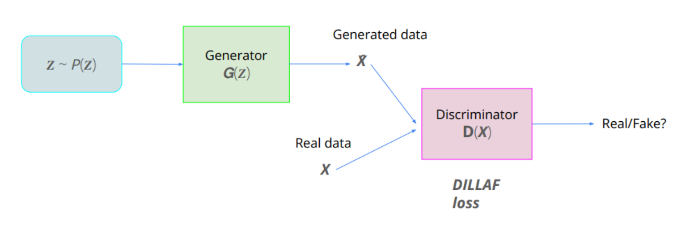

## GAN 的基本要素与目标

- **Generator** $G(z;\theta)$：从先验 $z\sim p_z(z)$（例如 $\mathcal{N}(0,I)$）生成样本 $G(z)$，希望生成分布 $P_G$ 与真实数据分布 $P_{data}$ 一致。  
- **Discriminator** $D(x;\phi)$：输出 $D(x)\in[0,1]$，表示输入 $x$ 为真实样本的概率。  
- **原始 min-max 形式**（Goodfellow et al., 2014）：

$$
\min_G \max_D \; \mathbb{E}_{x\sim P_{data}}[\log D(x)] \;+\; \mathbb{E}_{z\sim p_z}[\log(1 - D(G(z)))].
$$

- 判别器目标：对真实样本输出 1、对生成样本输出 0；生成器目标：使 $D(G(z))$ 趋近 1（“愚弄”判别器）。

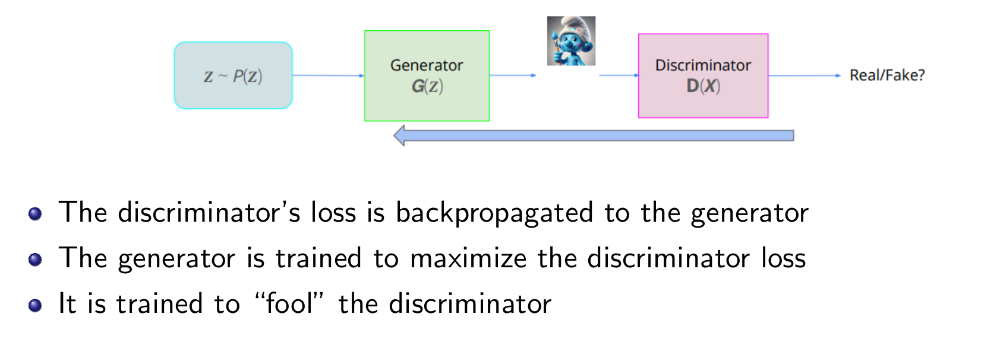

---

## 最优判别器与训练目标的解释

- 给定固定的 $G$，最优的 $D$ 可写为
- 
$$
D^*(x)=\frac{P_{data}(x)}{P_{data}(x) + P_G(x)}.
$$

- 将该式代回原始目标，可证明 GAN 的训练等价于最小化 **Jensen–Shannon Divergence (JSD)**（生成分布与真实分布之间的对称距离的一种形式）。当 $P_G = P_{data}$ 时，达到最优，此时判别器对任何样本输出 $1/2$。

$$
\text{JSD}(P,Q)=0.5D_{\text{KL}}(P, 0.5(P+Q)) + 0.5D_{\text{KL}}(Q, 0.5(P+Q))
$$

---

## 训练中的实际问题（不稳定性与 mode collapse）

- **训练不稳定**：对抗训练是双人博弈，不保证梯度下降会收敛（可能出现循环、振荡、发散等）。  
- **判别器过强**：若 $D$ 很快把真假区分开，生成器将得不到有效梯度（梯度消失），难以改进。  
- **判别器过弱**：提供误导性信号，导致生成器学出劣质或塌缩（mode collapse）解。  
- **mode collapse（模式坍缩）**：生成器只输出少数几类样本或甚至同一类样本，覆盖性差。
- **不收敛到全局最优**
- **不保证到达 stationary point**

---

## 实践中常用的改进技巧

### 1) 非饱和（non-saturating）生成器目标

为避免生成器在训练初期梯度消失，常用替代目标（maximize $\log D(G(z))$）：

$$
\text{Alt. Gen loss: } \quad \max_G \; \mathbb{E}_{z}[\log D(G(z))].
$$

该替代目标能给生成器提供更强的梯度信号（常见实现技巧）。

### 2) Instance Noise

在判别器输入处加入微小噪声（对真实与生成样本都加）来平滑判别器决策边界，使其在“点”附近也有有意义梯度，从而有助于稳定训练。

### 3) Least Squares GAN (LSGAN)

用 L2 损失替代二元交叉熵，减小损失范围与震荡：

- Generator 尝试最小化 $\|a - D(G(z))\|_2^2$；
- Discriminator 尝试最小化 $\|b - D(x)\|_2^2 + \|c - D(G(z))\|_2^2$。  

该方法使学习更平滑、数值稳定。

### 4) Discriminator Regularization（如 DRAGAN）

在真实数据附近惩罚判别器梯度的范数，避免判别器函数在真实样本处形成尖峰（peak），提升判别器的平滑性与泛化。

### 5) Unrolled GAN

在更新 generator 时模拟（unroll）判别器的若干步梯度更新，找到在判别器未来反应下 generator 的“最优”更新方向，并通过对这些步骤反向传播来更新 generator，从而缓解某些训练不稳或模式坍缩的问题。

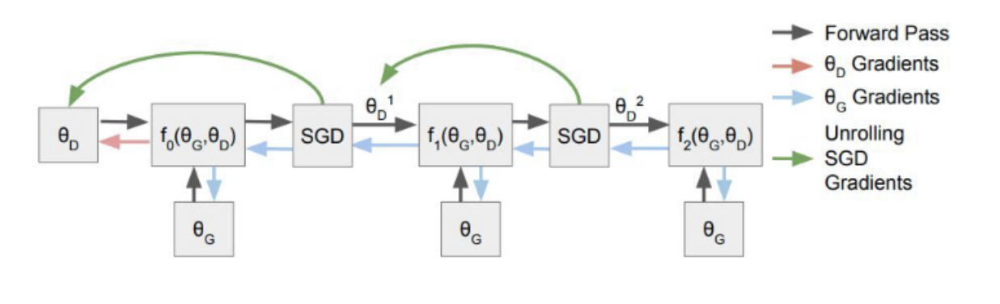

### 6) Divergence 替换：Wasserstein GAN（WGAN）

- 将 JSD/KL 替换为 **Wasserstein distance**（earth mover’s distance），它在分布支撑不重叠时仍能提供有意义且平滑的梯度。  
- 这通常需要对判别器（称作 critic）做 1-Lipschitz 约束（最初用权重剪切，后用 gradient penalty 更稳定）。

---

## 体系结构与案例

- 经典 DCGAN（卷积生成器 + 判别器）在图像生成上开创了许多实践规范（如 batch norm、去全连接层过多的用法等）。  
- 讲义中以 **anime avatar** 为例展示生成结果与训练流程（见讲义图示）。:contentReference[oaicite:12]{index=12}

---

## 从 VAE 到 Diffusion Models（层级 VAE 的观念）

- VAE 在一次性将 $z\sim\mathcal{N}(0,I)$ 转化为复杂数据分布时往往显得步幅过大，导致生成模糊。为此提出**层级 VAE（Stacking VAEs）**或逐步解噪的思想。:contentReference[oaicite:13]{index=13}

---

## Denoising Diffusion Probabilistic Models (DDPM)

### 基本思想

- **Forward（扩散）过程**：从真实数据 $x_0$ 通过逐步添加高斯噪声，得到一系列 $x_1, x_2, \dots, x_T$，最终使 $x_T$ 接近标准正态：
- 
$$
q(x_t \mid x_{t-1}) = \mathcal{N}\big(x_t; \sqrt{1-\beta_t}\, x_{t-1},\, \beta_t I\big),
$$

其中 $\beta_t$ 是预定的噪声调度（noise schedule）。

- **闭式表达**：任意时刻 $t$ 可直接采样：

$$
q(x_t \mid x_0) = \mathcal{N}\big(x_t; \sqrt{\bar\alpha_t}\, x_0,\; (1-\bar\alpha_t) I\big),
$$

其中 $\bar\alpha_t = \prod_{s=1}^t (1-\beta_s)$，并且可以写成

$$
x_t = \sqrt{\bar\alpha_t}\, x_0 + \sqrt{1-\bar\alpha_t}\, \varepsilon,\qquad \varepsilon\sim\mathcal{N}(0,I).
$$

### Reverse（去噪）过程 —— 生成

- 目标是学习条件分布 $p_\theta(x_{t-1}\mid x_t)$，通常用高斯近似：

$$
p_\theta(x_{t-1}\mid x_t) = \mathcal{N}\big(x_{t-1}; \mu_\theta(x_t, t),\; \sigma_t^2 I\big).
$$

- 训练等价于学习如何一步步去除噪声（stack of denoisers）——可视作堆叠的可学习 VAE decoder

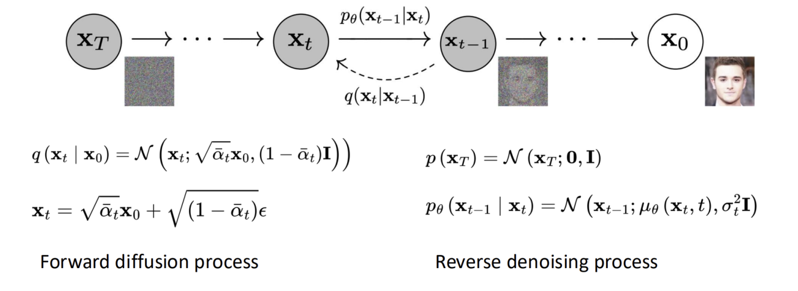

### Compare with VAE

VAE 的 decoder 需要将一个高斯分布用一步来转移到目标分布上

- 两者经常有较大间隔
- 会产生模糊的输出

### DDPM / DDIM

- **DDPM**：使用 U-Net 等强大网络训练逐步去噪模型并能生成高质量图像（训练时间长但样本质量优异）。
- **DDIM**：提供更少步骤生成的变体（deterministic or implicit sampling paths），以减少采样步骤数。

## 现代 Diffusion-based 系列与应用

- **Stable Diffusion**：在 VAE 的 latent 空间上做 diffusion（latent diffusion），大幅降低计算与内存开销，实现文本条件高分辨率合成（配合大规模文本-图像模型）
- 讲义还列举了 DALLE（hierarchical text-conditional generation）、DiT（transformer for diffusion）、MAR（autoregressive with diffusion loss）等近期相关工作。
